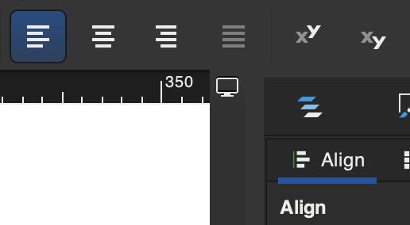

# My experience and learning from doing youtube tutprial "FreeCAD BIM: Create Site Plan from 3D Model Using Tech Draw Workbench"

See <https://youtu.be/erN5h4HxGZ0?list=PL3wRqQUPtE16yw_c1TnRYJmz37y2ZRTLm>

Please consider to support the creator of the tutorial video at <https://ko-fi.com/s/391226909e>

## Consider the presenter options of 'Draft workflow' vs. the 'Techdraw workflow'

See youtube video <https://youtu.be/pP9fL-zfQyA?list=PL3wRqQUPtE16yw_c1TnRYJmz37y2ZRTLm>.

It seems this is his names for two possible worksflows he has identified to use in Freecad?


It seems the 'Draft workflow' is based on a two step process?

1. Create a 'Draft' 2D drawing in the 3D model.
2. Place one or more such 'Drafts' on 'Pages'.


The presenter seems to state that this workflow is preferred top be able to create all required drawings for a BIM project?

It seems the 'Tech draw workflow' also includes two main steps (but does not create any 2D drawings in the 3D space)?

1. Create a 'Technical Drawing'
2. Place 'sections' directly from the 3D model onto the page.


He seems to state that this 'Tech draw workflow' is inferior to the 'Draft workflow' in that the set of possisble drawings are limited by the 'Technical drawing' workbench tools?


He seems to state that this limitation comes from the fact that the 'Draft' workbench uses *totally different* libraries than the 'Technical Drawing' workbench (see <https://youtu.be/pP9fL-zfQyA?list=PL3wRqQUPtE16yw_c1TnRYJmz37y2ZRTLm&t=256>)?

Anyhow, in the tutorial the presenter still uses the more restricted 'Technical Drawing' workflow. 

## The 'Page' is a thing in the 'Techdraw' workbench

It seems to create a 'Page' to hold our drawing we use the 'Insert Page using template' tool in the 'Techdraw' workbench?


Note: I used the svg-file from the download (see <https://ko-fi.com/s/391226909e>)


So this seems to sugest I can make my own svg-file and use as a template in Freecad (like the presenter in the video does)?

Note: It seems an svg-file is in fact in XML format? And the editable text fields are tageed with '\<text...' in the xml?

```xml
<text
    id="project_name_field"
    x="226.34004"
    y="259.685"
    freecad:editable="title"
    freecad:autofill="title"
    style="font-style:normal;font-variant:normal;font-weight:500;font-stretch:normal;font-size:5px;font-family:Ubuntu;-inkscape-font-specification:'Ubuntu, Medium';font-variant-ligatures:normal;font-variant-caps:normal;font-variant-numeric:normal;font-variant-east-asian:normal;text-anchor:start;fill:#000000;stroke:none">
```
## It seems I may be able to create my own A3 template for technical drawings?

Suppose I look at the presenters svg-file and the text elements that it exposes?


I managed to create my own svg-file with the logo of my company. The task was to get a jpg-file of my logo and then convert it to base64 encoding and replce the image-tag with the base64-data of my logo.

1. I began with my logo in png-format.
2. In macOS I opened the file in preview (double-click the file)
3. I exported it as a new png-file and unchecked the 'alpha' channel option.

The thing with my png-file was that the alpha channel was set to gibe the image a transparent background. But if I exported such a picture to jpg then my macOS would create a logo with a very dark background and the text itself in a strange darkish red?

4. I opened the new png-file in preview.
5. Now I was able to export it to jpg and get an image with a white background.

My jpg-image was 1280 × 671 in size. To make it for into the 30 x 30 pixel box that the presenters svg-file-image was using I had to recalculate the height and width.

* Width 1280 / 42 = 30,47 (close enough)
* Height 671 / 42 = 15,98 --> 16 is close enough.

The image tag after my edit to the svg-file was:

```xml
<image width="30" height="16" preserveAspectRatio="xMidYMid"
    xlink:href="data:image/jpeg;base64,/9j/4Q/+RXhpZgAATU0AKgAAAAgABwESAAMAAAABA...
```

Which in Freecad gave me the bottom left corner of a page created with my template to be:


So much work for so little result...

NOTE: Something got broken in my file! At some point Freecad stopped accepting the template. Freecad reported strange errors and some fileds was no longer editable.

## It seems I can also edit the svg-file template in Incscape?

I tried editing the presenter svg-file template in Inscape on macOS. And I succeeded to create a template file that worked. I added my company logo and adjusted fonts to 'Arial' and sizes to  integer values. I also adjusted the position of some fields. 

## Beware - Toggle 'Frames' for Page to get rid of 'artefacts'

I was first confused about artefacts that looked like underlines and other strange stuff. But it turned out to be Freecad showing something called 'frames'.


To change this setting you right click on the open technical drawing 'page' and select 'Toggle Frames'. 

## Beware - you must have 'Frames' on to be able to edit text fields on the page!

At first I was confused why my page no longer allowed editing of text fields!

It turns out that 'Frames' must be toggled **on** to allow me to click on them and edit their text value!

## Beware - Ensure the text fields are defined with correct text alignments!

In Incscape, you have to click on the text field until you get a cursor to edit it. You are now in 'text mode'. Now you get the 'text alignment' tool buttons and can one-by-one select each text field and set the alignment you want! 

Wow - this was tedious and a house-of-cards to get everything right!



*Above is the text alignment tool buttons (in **Incscape**) that becomes available when a text field is selected in 'text mode'*

## Beware - The svg-template edited in Incscape still behaves strangely in Freecad!

Actually, after having tried to edit the svg-template over and over to make e.g. the 'NR' field text be correctly placed in the box by Freecad I kind of gave up. It seems the 'style' set by Incscape is not consistent? For example, the style property 'text-align: center' and 'text-anchor: middle' seems to work better but at one time I had to enter them manually in Incscape? But I may be confused? There are just so many properties and tags and I to me it is totally opque what effect they would have in Freecad?

Anyhow, I created a template this kind-fo work for now...


## Beware that command-B (macOS) 'Box select' is drag-to-select NOT click-move-click!

I was at first cinfused why 'Box select' did not work. I clicked command + 'B' (contol + 'B' on windows). Then I clicked, moved and clicked again. But nothing happened! I did this because so many draw command in Freecad is cick-tgo-start, then move, then click-to-end. But the 'Box select' opoeration id **drag-to-select**!

## It seems 'Insert View' projects selected 3D model 'things' onto a 'page'?

The semantics here is a bit confusing?

1. Select 3D model objects that are to be included in a 'view'
2. Click the 'Insert View' tool button


3. Freecad now opens a kind-of 'placement' dialog named 'Part view' in the task panel.

Again we have the generic term 'Part' which is a bit strange when I am working with elements of my BIM workbench 3D model of my house.

Bit ok, the dialog seems to bde about deciding how to project the 3D 'things' I have selected onto the 2D view / page.


## Beware that I need to set a cistom scale AND a POSITIVE Z-axis

It seems that what I define in the dialog is how to orient the 3D 'things' I have selected so that I get the view I want looking DOWN on it. That is, If I click the down-arrow in the dialog until I have the center vector showing the orientation X=0, Y=0, Z=1, then I get a view of my house from 'above'?

I interpret this as the orientation if for the object as it would look like if the page is on the XY-plane and the Z-axis is 'up' from the 'page'?


NOTE: My house ended up larger than the house the presenter in the video created. So I had to use a 1:70 scale to have the house fit on the paper.

At this stage my page looked like this.


