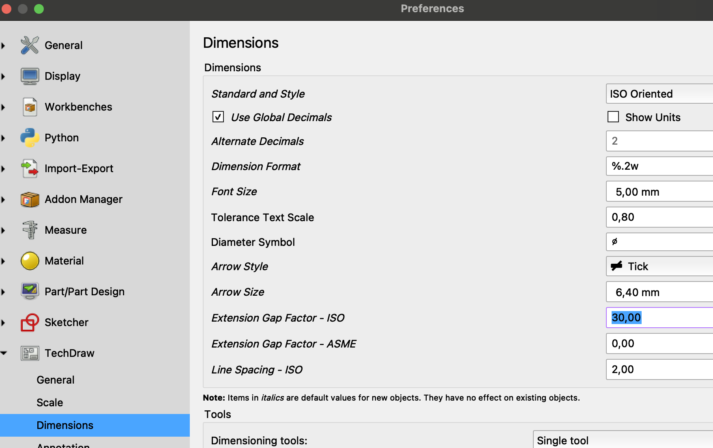
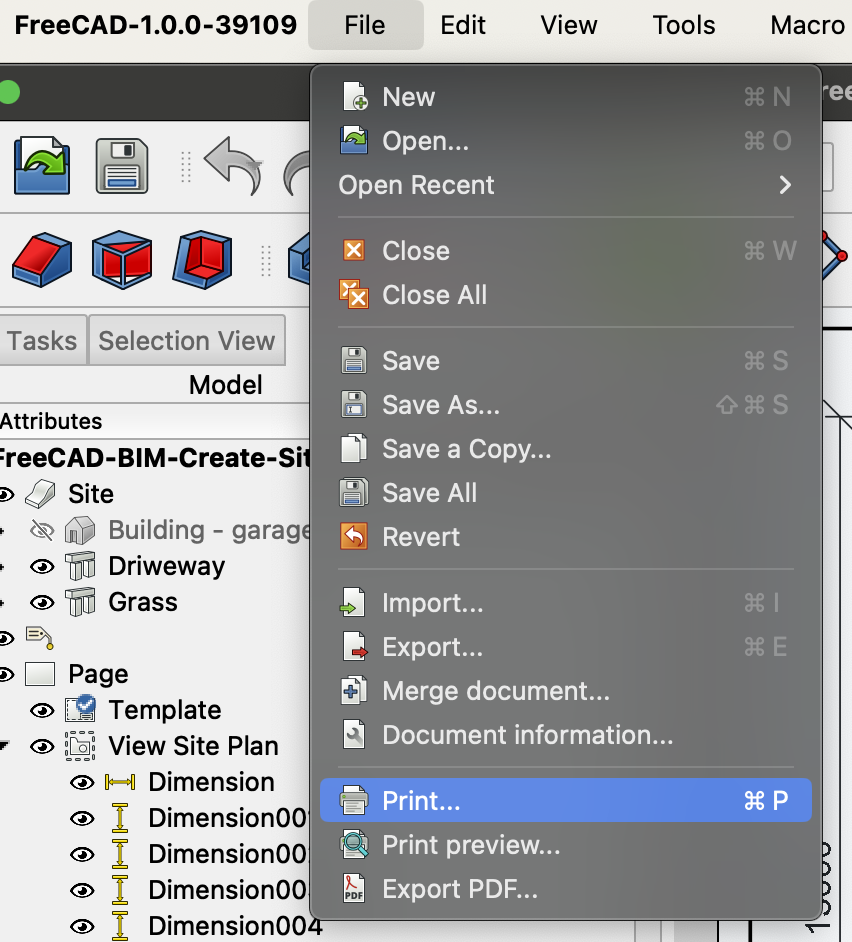

# My experience and learning from doing youtube tutprial "FreeCAD BIM: Create Site Plan from 3D Model Using Tech Draw Workbench"

See <https://youtu.be/erN5h4HxGZ0?list=PL3wRqQUPtE16yw_c1TnRYJmz37y2ZRTLm>

Please consider to support the creator of the tutorial video at <https://ko-fi.com/s/391226909e>

## Consider the presenter options of 'Draft workflow' vs. the 'Techdraw workflow'

See youtube video <https://youtu.be/pP9fL-zfQyA?list=PL3wRqQUPtE16yw_c1TnRYJmz37y2ZRTLm>.

It seems this is his names for two possible worksflows he has identified to use in Freecad?


It seems the 'Draft workflow' is based on a two step process?

1. Create a 'Draft' 2D drawing in the 3D model.
2. Place one or more such 'Drafts' on 'Pages'.


The presenter seems to state that this workflow is preferred top be able to create all required drawings for a BIM project?

It seems the 'Tech draw workflow' also includes two main steps (but does not create any 2D drawings in the 3D space)?

1. Create a 'Technical Drawing'
2. Place 'sections' directly from the 3D model onto the page.


He seems to state that this 'Tech draw workflow' is inferior to the 'Draft workflow' in that the set of possisble drawings are limited by the 'Technical drawing' workbench tools?


He seems to state that this limitation comes from the fact that the 'Draft' workbench uses *totally different* libraries than the 'Technical Drawing' workbench (see <https://youtu.be/pP9fL-zfQyA?list=PL3wRqQUPtE16yw_c1TnRYJmz37y2ZRTLm&t=256>)?

Anyhow, in the tutorial the presenter still uses the more restricted 'Technical Drawing' workflow. 

## The 'Page' is a thing in the 'Techdraw' workbench

It seems to create a 'Page' to hold our drawing we use the 'Insert Page using template' tool in the 'Techdraw' workbench?


Note: I used the svg-file from the download (see <https://ko-fi.com/s/391226909e>)


So this seems to sugest I can make my own svg-file and use as a template in Freecad (like the presenter in the video does)?

Note: It seems an svg-file is in fact in XML format? And the editable text fields are tageed with '\<text...' in the xml?

```xml
<text
    id="project_name_field"
    x="226.34004"
    y="259.685"
    freecad:editable="title"
    freecad:autofill="title"
    style="font-style:normal;font-variant:normal;font-weight:500;font-stretch:normal;font-size:5px;font-family:Ubuntu;-inkscape-font-specification:'Ubuntu, Medium';font-variant-ligatures:normal;font-variant-caps:normal;font-variant-numeric:normal;font-variant-east-asian:normal;text-anchor:start;fill:#000000;stroke:none">
```
## It seems I may be able to create my own A3 template for technical drawings?

Suppose I look at the presenters svg-file and the text elements that it exposes?


I managed to create my own svg-file with the logo of my company. The task was to get a jpg-file of my logo and then convert it to base64 encoding and replce the image-tag with the base64-data of my logo.

1. I began with my logo in png-format.
2. In macOS I opened the file in preview (double-click the file)
3. I exported it as a new png-file and unchecked the 'alpha' channel option.

The thing with my png-file was that the alpha channel was set to gibe the image a transparent background. But if I exported such a picture to jpg then my macOS would create a logo with a very dark background and the text itself in a strange darkish red?

4. I opened the new png-file in preview.
5. Now I was able to export it to jpg and get an image with a white background.

My jpg-image was 1280 × 671 in size. To make it for into the 30 x 30 pixel box that the presenters svg-file-image was using I had to recalculate the height and width.

* Width 1280 / 42 = 30,47 (close enough)
* Height 671 / 42 = 15,98 --> 16 is close enough.

The image tag after my edit to the svg-file was:

```xml
<image width="30" height="16" preserveAspectRatio="xMidYMid"
    xlink:href="data:image/jpeg;base64,/9j/4Q/+RXhpZgAATU0AKgAAAAgABwESAAMAAAABA...
```

Which in Freecad gave me the bottom left corner of a page created with my template to be:


So much work for so little result...

NOTE: Something got broken in my file! At some point Freecad stopped accepting the template. Freecad reported strange errors and some fileds was no longer editable.

## It seems I can also edit the svg-file template in Incscape?

I tried editing the presenter svg-file template in Inscape on macOS. And I succeeded to create a template file that worked. I added my company logo and adjusted fonts to 'Arial' and sizes to  integer values. I also adjusted the position of some fields. 

## Beware - Toggle 'Frames' for Page to get rid of 'artefacts'

I was first confused about artefacts that looked like underlines and other strange stuff. But it turned out to be Freecad showing something called 'frames'.


To change this setting you right click on the open technical drawing 'page' and select 'Toggle Frames'. 

## Beware - you must have 'Frames' on to be able to edit text fields on the page!

At first I was confused why my page no longer allowed editing of text fields!

It turns out that 'Frames' must be toggled **on** to allow me to click on them and edit their text value!

## Beware - Ensure the text fields are defined with correct text alignments!

In Incscape, you have to click on the text field until you get a cursor to edit it. You are now in 'text mode'. Now you get the 'text alignment' tool buttons and can one-by-one select each text field and set the alignment you want! 

Wow - this was tedious and a house-of-cards to get everything right!


*Above is the text alignment tool buttons (in **Incscape**) that becomes available when a text field is selected in 'text mode'*

## Beware - The svg-template edited in Incscape still behaves strangely in Freecad!

Actually, after having tried to edit the svg-template over and over to make e.g. the 'NR' field text be correctly placed in the box by Freecad I kind of gave up. It seems the 'style' set by Incscape is not consistent? For example, the style property 'text-align: center' and 'text-anchor: middle' seems to work better but at one time I had to enter them manually in Incscape? But I may be confused? There are just so many properties and tags and I to me it is totally opque what effect they would have in Freecad?

Anyhow, I created a template this kind-fo work for now...


## Beware that command-B (macOS) 'Box select' is drag-to-select NOT click-move-click!

I was at first cinfused why 'Box select' did not work. I clicked command + 'B' (contol + 'B' on windows). Then I clicked, moved and clicked again. But nothing happened! I did this because so many draw command in Freecad is cick-tgo-start, then move, then click-to-end. But the 'Box select' opoeration id **drag-to-select**!

## It seems 'Insert View' projects selected 3D model 'things' onto a 'page'?

The semantics here is a bit confusing?

1. Select 3D model objects that are to be included in a 'view'
2. Click the 'Insert View' tool button


3. Freecad now opens a kind-of 'placement' dialog named 'Part view' in the task panel.

Again we have the generic term 'Part' which is a bit strange when I am working with elements of my BIM workbench 3D model of my house.

Bit ok, the dialog seems to bde about deciding how to project the 3D 'things' I have selected onto the 2D view / page.


## Beware that I need to set a custom scale AND a positive Z-axis

It seems that what I define in the dialog is how to orient the 3D 'things' I have selected so that I get the view I want looking DOWN on it. That is, If I click the down-arrow in the dialog until I have the center vector showing the orientation X=0, Y=0, Z=1, then I get a view of my house from 'above'?

I interpret this as the orientation if for the object as it would look like if the page is on the XY-plane and the Z-axis is 'up' from the 'page'?


NOTE: My house ended up larger than the house the presenter in the video created. So I had to use a 1:70 scale to have the house fit on the paper.

At this stage my page looked like this.


## The Techdraw workbench 'Insert Dimension' tool


It seems inserting a dimension is a sthree step process?

1. Select the edge for which I want to insert a dimension on the drawing.
2. Click the 'Insert Dimension' tool

3. Click where the dimension annotation should be placed.

## Beware that the default size of annotations on 'Techdraw workbench' does NOT adjust to the scale of existing objects

So in this video the presenter shows how we scale down the house 1:50 (1:70 in my case) to have the site plan fit on the page. BUT - When I now insert a dimension the label is **huge**!

<figure>
  
  <figcaption><em>HUGE annotation text size on scaled-down drawing</em></figcaption>
</figure>

NOTE: The presenter does not have this problem in the video!

It seems the default size of labels on Techdraw drawings are defined in Freecad Preferences then 'Techdraw'?


And **the font** is defined in 'General' and 'Label Font*'?


Note: I changed to 'Arial' as I like this better than the default 'Academy Engraved LET'.


NOTE: The 'Label Size' does NOT seems to affect the size of the text for Dimensions?

Instead it seems the text size of dimensions are defined in 'Dimensions' and 'Font Size'?


But I find this quite opaque? What does a 'Font Size' of '5 mm' actually mean? In what world does 5 mm make sense? Maybe the 5 mm is the actual size on the A3 page?

## It seems the 'Gap Factor' defines a distance between a measurement 'arrow' end marker and the object?

The presenter describes how in architectual drawings one usually prefer NOT to draw the reference line for annotaed distances all the way to the object.

So if we have a measurement annotaed like this.


Then we can change the 'Gap Factor ISO' of a selected measurement in the drawing to, as the presenter in the video sugests, 30.


Now Freecad whows the measurement annotation with 'a gap' to the referenced object.


Note: I tried to find a definition of the 'Gap Factor ISO' but failed. In my drawing a Gap factor over 30 had no effect. That is, at Gat factor 30 the gap is as large as it gets?

## Beware that you may need to do '

The presenter in the video showed how, if we change the default settings for 'Gap Factor ISO' and also the 'Arrow Style' in Preferences and 'Dimensions', then we may need to also click on 'Redraw Page' gto have the changes taake effect.

So say we change the default preferences for 'Gap Factor' and 'Arrow Style' in Freecad preferences.



Then, in the 'Techdraw workbensh' we need to click 'Redraw Page'.


And now our arows styles are with tick ok.


## Beware that you must select a view before using the 'Add Leaderline to View' Techdraw workbench tool

If we try to click this tool without having a 'view' on drawing selected.


Then we get an error.


So you must first select a 'view' in the 3D model tree.


It seems we need to interact with the Dialog to define a leaderline to add?


The process seems to be:

1. Click on 'Pick Ponts'
2. Click to define the leaderline points locations.
3. Click on 'Save Points'


## Beware that the leaderline is not shown as defined in the 'create dialog' until we click ok

So while I define the leaderline it seems the line is shown as 'dotted' and not with the attributes defined.


Then when we click ok we can see how the leaderline actually looks!


## Beware that we add actual text unattached to any leaderline or other 'things' on the drawing

The presenter in the video described how we use the 'Insert Annotation' in the techdraw workbench.


The presenter also described how the annotation object is tottaly 'free' and unrelated to any leaderline (or eny other objects on the drawing?).

## Beware that the new Annotation is placed in the center of the drawing and we need to manually move it!

At this stage I thought I had to enable 'Frames' (right click and select 'Toggle Frames' until freams ar enabled). 


But later I was able to move the annotation even if frames was not enabled.

## Beware that Freecad will copy-and-paste an 'Annotation' outside the page!

It seems that if I copy-and-paste (control+C and control+V) then Freecad will place the annoptation copy outside the page! 


ANd to be able to see it and move it to place we need to manually move it inside the page again.

## Beware the trick to insert superscipt '2' into Freecad annotation on macOS

On my macOS I can open the 'Character Viewer' with control + command + space. But this does NOT work in the text edit dialog of the Freecad annotation! Instead I opened a macOS document like Pages and insrted the superscript '2' there. Then I could copy-and-paste it to Freecad annotation text.


1. Open a Pages document
2. Press control + command + space
3. Enter 'superscript' in the search field.
4. Doubble-click on the superscipt '2' in the search result


I now have the superscipt '2' in my Pages document

5. Copy-and-paste the subscript '2' from my Pages document to the Freecad annotation text


Annoying! But at least it works...


## Beware that the area measure tool only works on 3D model objects (not on 2D 'Page' drawing counterparts)!

The presenter in the video described how we must go to the 3D model and measure the Garage footprint area on the Garage slab object (called 'Floor Slab' in my model).

1. Select the 'Floor slab' object in the 3D model
2. Click the 'Measure' tool


Freecad now shows the area of the slab.


And I could manually enter this value into the annotation.


NOTE: This means in Freecad we can NOT define these kind of data to be automatically updated if we make changes to the model?

## Beware that Freecad does NOT switch to the 'Techdraw' workbench when I select a 'Page'!

I could not find the 'Hatch a Face using Image File' tool even though I was editing my Page. 


It turned out that Freecad was in the 'Part Design' workbench! When I switched to the 'Techdraw' workbench the 'Hatch a Face using Image File' tool was available again.

*NOTE: The more I use Freecad the more it becomes appearent that the user interface is a bit of a house-of-cards?*

Anyhow...

## Beware that the 'Create Face Hatch' tool uses svg-files chosen by the user (not a wisywig user interface)

It would of cource be nice if Freecad offered a 'what you see is what you get'. But instead Freecad offers me as a user to select a built-in svg-file.


1. Choose a file
2. Click on another input field in the dialog to update the view
3. Adjust the 'SVG Pattern Scale' and click on another input field to upodate the view.

In this way I could kind of iterate settings until I had the look-and-feel I wanted.


## Beware that you need to switch to the BIM workbench to be able to move the inserted north symbol!

I was able to open the Freecad-file with the North symbol in it. And copy-and-paste also worked.

But - Then I could not move it! I was confused. But it turned out I was in the wrong workbench (I was still in 'Techdraw' workbench).

I find it confusing how I should understand the concept of a 'workspace'? In this case I pasted an object from the 3D model of another freecad file (in this case the North symbol).

1. I had to select the tab with my freecad file (my 3D model) to paste the symbol.
2. I pasted with control-V into my 3D model.
3. I could see the symbol at origo of my 3D model view


But now I was unable to move it! I could to grab and move it. And there was no 'Move' tool in any of the tool bars.

It turned out I was still in the 'Techdraw' workbench! 


I had to manually switch to the 'BIM' workbench!


## It seems the 'Rotate' tool allows a first Enter to accept a base angle but the second Enter closes the Rotate dialog?

At first I did not understand how the presenter in the video could enter the base angle and then get the dialog to ask for the rotation. It turns out that when I start the tool it allows the user to press Enter to define the base angle.


I can now safelly enter 0 and press Enter without the Dialog closing down.


Note: This is confusing! All dialog I have used so far has closed on Enter! I have made this mistake so many times! But so I have to remember that the 'Rotate' dialog behaves differently.

## Beware - Don't forget to select the Page and switch to the 'Techdraw' workbench to find the 'Insert View' tool!

Again, to have the north symbol appear on the Page we need to 'view it'. That is, we need to 'create' a 'view' and place it on the 'page'.

But to do this we need to:

1. Select the north symbol in the 3D view.
2. Switch to the Page tab for our Techdraw page 'thing' (object?)
3. Switch to the 'Techdraw' workbench!

Now we can click the 'Insert View' tool.


And then use the 'Insert View' dialog as before.

## Beware - to be able to move the north symbol view you need to turn on 'Frames'!

Before I was actually able to move annotations without 'Frame' being enabled. But to move the north symbol view I had to 'Toggle Frames' on!

## It seems the view of the north symbol did NOT include the black filling of the left face?

In the 3D view (the main freecad file) the inserted north symbol has one face shadowed in light gray.


But the view we created of it on the page does NOT have any face shaded?


The presenter does not explain why that is? He just insert a 'solid hash'.

I find this confusing? I would like a 'view' to use the stuff from the viewed object I'd like to include. I do NOT like to add-on my own edits to the view. This seems 'messy'?

Anyhow...

My page now looks like this.


## It seems Page 'Export PDF' and Print to pdf works fine?

The presenter showed how to 'Export to pdf' which I tried with success.

I could right click the page and select 'Export PDF' ok.


I also tried to print to pdf ok.




## Beware that meny 'File' and 'Export' to PDF requires a selected Page and renaming exported file to '.pdf'!

It seems the File menu 'Export' is a swiss army knife that requires some cuddling to have it create a pdf?

1. Select the 'Page' in the 3D model tree view.
2. Click File meny and then 'Export'
3. Select the drop down for file type and select '*svg *.dfx *.pdf'


4. Then rename the file name to have the '.pdf' extension!


5. Click 'Save'

For me this worked and I got a pdf-file with the expected content.

*But - This is quite an elaborate operation to get right?*

## Beware that Freecad assigns a default 'face colour' that are light grey!

The presenter explains why the faces of the site plan in the pdf are shaded and not white.

It seems I need to select each 'View' object on the Page and go to the property pane 'view' tab and the 'Face Color' property value.


I can now edit this 'Face color' to be full white.


Note: For me there was NO shading of objects on the page?!

AHA - The reason I had no problem is that for me Freecad had assign the 'Face Transparency' to 100. This means the 'Face Color' has NOT EFFECT! But the presenter in the video had a transparency setting of 0. So for him the Face Color will show up in the PDF...

AHA again! For me Freecad had checked the Freecad Preferences for 'TechDraw' and 'Colors' property 'Transparent Faces'.


It seems the presenter sugests I should NOT check the 'Transparent Faces' Freecad Techdraw preference setting?

Note: The box to the right of the 'Transparent Faces' preference checkbox is the default Face Color!


I changed this Color to pure white (as the presenter sugested).

## It seems a 'Techdraw' view object keeps updated to the object it is a view of (dimensions will change with edits)

The presenter showed how changing the dimensions of the site perimeter actually did show also on the Page.

The view seems to pick up the change and update the view onto the page?


Note: For some reason my house model did not contain any 'Plot' drawing (wires)? So I edited the 'Grass' sketch instead and this had a simmilar effect.

Done!
