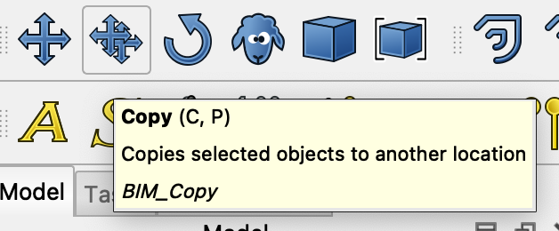
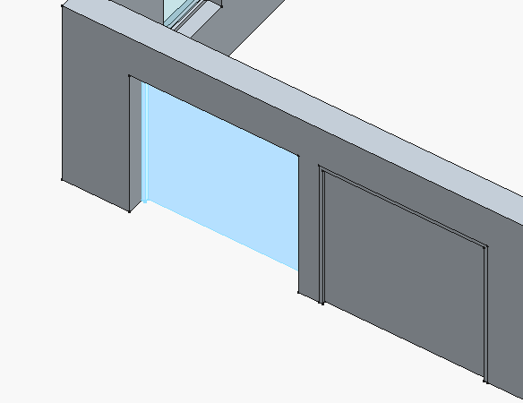
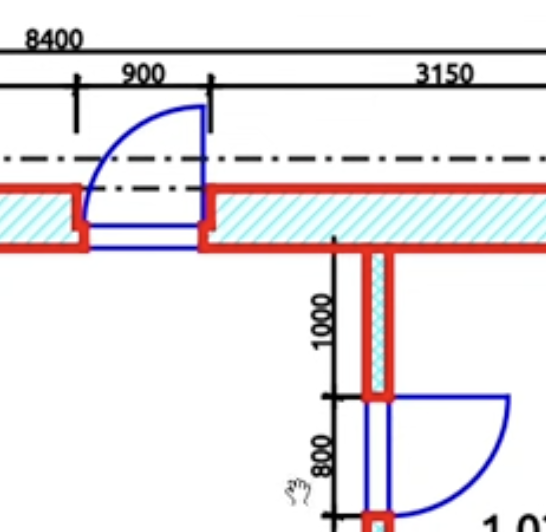

# My comments following youtube video 'FreeCAD BIM Tutorial for Beginners | Create a Garage Building'

See (https://youtu.be/WZHyUBfdgJA?list=PL3wRqQUPtE16yw_c1TnRYJmz37y2ZRTLm)

NOTE: My model turned out with the wrong external wall size (see below). Pleas be beware of this if you are to open my model and inspect it.

## BIM workbench rectangle has a 'make face' property

The presenter 'turns off' the face of the first drawn rectangle.

It seems I have to learn how FreeCad presents 'things' in the BIM workbench? To me a rectangle is more the boundary that an area. But on the other hand, I can buy that a rectangle can have a 'face' or not by its 'Make face' property.

## BIM workbench Wall tool

It seems the BIM wall tool can create a 'wall object' from scratch or from one of a 'wire', a 'face' or a 'solid'.

*I wonder what creating a wall from a solid would imply?*

## Alignment of Wall from rectangle refers to walking the rectangle boundary in clockwise direction

If I 'right align' my created wall it seems it is placed 'inside' the rectangle? Whuch in turn sugests that in a rectangle all 'wires' are oriented clockwise around the rectangle center?

NOTE: Later (See below) it turns out my wall was aligned 'left' for some reason. This is WRONG but at that stage I chose not to go back an fix everytging that is in the wrong place if I fix my external wall.

## The Line colour of the rectangle is shown ONLY when not selected!

I changed the rectangle 'Line color' to red but the rectangle was still blue!

Only when i clicked outside anything did the red colour show.

## The BIM 'Site' object maps to top level of 'Industry Foundation Classes (Ifc)

See (https://en.wikipedia.org/wiki/Industry_Foundation_Classes)

## The BIM workbench uses a movable 'working plane' for drafting

It seems in the BIM workbench we are to 'draft' as in draw 2D geometry to then use e.g., to create 3D objects.

The presenter in the tutorial shows how to turn on snapping to the working plane.

When snapping to working plane I can draw the rectangle on the top of the external walls and still have the rectangle placed on the working plane at the bottom.

## The 'Slab' tool seems to grow the slab 'out' as in 'down' for a floor?

It seems the slab grows in the direction of the normal of a face. And as we have already established that a rectangle has its edges oriented clockwise around its center, this means the normal if the rectangle will face 'into the clock face' which will be 'down' for a floor based rectangle.

## BIM Object creation will ignore levels?

When I create BIm objects, e.g., a 'slab', it will be placed in the tree root. That is, it will ignore any selected object and will not say place the new object inside a selected level object.

## BIM 'Move Line' tool a bit quirky?

It seem, to move a line:

1. Click on the line in the model tree to select it
2. Click the 'Move' tool

3. Click somewhere in the 3D view (to 'start' the move operation?)
4. Press 'X','Y' or 'Z' to restrict the move along an axis

5. While moving the cursor, the task dialog shows the value moved.

6. Enter the value to move and hit enter.

## BEWARE the 'Home' orientation!

When I added the first internal wall I for some reason managed to rotate the house to be 180 degrees 'wrong' around the up (z) axis!

It seems I can engange 'Home' from the 'View' menu (or fn + left-arrow on mac keyboard)

And it seems the 'Home' orientation is with X to the right and Y like 'in' to the screen (and Z is up)=

So beware the 3D orientation for symetrical objects to get it right from the beginning!

At this stage I had the first interor wall in place.

## Shift-to-focus-move-direction does not work on mac keyboard?

The presenter explains how he starts a move in a dirction and then holds Shift for a while to have Freecad lock in on that axis of movement. But on my Macbook Pro nothing happens when I do this.

Instead, what works, is to start the move, then press 'Y' to lock movement in the Y-axis direction and then press tab until the move dialog selects the 'Length' field an I can enter the exact move amount and hit Enter.

The non-working Shift-to-lock-move-axis may be because I am using the 'Touchpad' Navigation Style? Here the Shift key is used in combination with the touchpad to move my 3D view. 

But it may also be that the key bindings on mac differs from those used by the presenter in the video?

## The Wall-tool does not select the Wall after creation (wrong properties shown)

A couple of times I created a wall and then searched the property pane to adjust the height and width. But I could not find these properties. The reason was that the created wall was not the selected object in the model tree!

So remember: Always select the wall after it has been created to be able to edit its properties.

## Using the Window-tool is quirky

It seems the 'Auto include in host object' option means the window will create an actual opening on the wall it is placed?

Also, The 'Sill height' is the position of the window sill above the wall bottom?

I tried to select the corner edge to place the window in the corner as the presenter said he did. But then my window was placed in mid-air above the wall? 

NOTE: It seems once the winow is placed it is 'dead' in that I cant grab it and move it to some other placement?

The window is also placed *inside* the wall object in the model tree view! This is a little surprising given that walls and slab so far has NOT been placed inside anything?

I have to drag the 'create window' to the corner bottom vertex to have it be placed in the corner.

NOTE: The window is actually on the right side wall. What looks like a window on the left side wall is NOT a window. I can't click there to select anything. *Strange...*

The 'Offset' property is actually the amount of inset of the window into the wall.

## Move and Copy are separate tools

## Beware of scrolling property values!

The window I created somehow ended up at 1496 mm after I had moved it 1500 mm as instrcuted. The reason was that I had somehow set 'H1' property to -4 mm!

I am pritty sure this happened because I scrolled the property window. But when the cursor ends up over a numerical input field, the action changes from scrolling the pane, to scrolling the integer value!

This was hard to find! Also, why does the property allow a negative frame width?

NOTE: There is also no 'reset' what I can see. So if you screw up any property value I don't know how to rescue the sitation back to the defaults?

## I had a hard time get the meassurments correct

To actually select an edge you have to be very careful to not select a face, a wall or the window. The correct way seems to move the cursor close to the edge until the face is no longer selected. Now the edge is probably selected.

Also, once I got the frame width (fixed my neggative H1 property value) I found that the moved distance shows up between the external wall left corner and the outside of the window frame. Quite obvious once I succeeded. But before I had gotten all kinds of strange locking to objetcs and following stramnge measurements...

## Beware window can be placed also in 'thin air'

The presenter in the video shows that if we place the window so that it is not actually on the wall, then tthis is still ok according to Freecad.

In this case this happens because the window is placed with the origo located at the window lower left corner.

Still, this is a bit clumsy user interface, is it not?

**It feels like Freecad just offers to many degrees of freedom to the user?**

Anyhow, it still works though...

## The 'Door' and the 'Window' tool are the same tool!

Even though I click the door tool, it is the window property pane that shows up. This seems to be by design (and the user interface has not yet been cleaned up)?

NOTE: The property window for the 'Door' is labeled 'Window options'...

NOTE: I had to enable the 'Snap midpoint' to be able to place the door as the presenter did att the wall midpoint. Thus, Freecad does not enable midpoint snapping by default in BIM workbench?

After creation the 'door' still is labeled, and even rendered, as a window (see label 'window004' in my model).

## The 'snap to midpoint' is NOT a constraint!

Even though I created the garage door 'snapped' to the wall midpoint, it is NOT fixated there. I am still able to move it to its correct position (just as the presenter in the video shows).

AHA! No, I missed that I need to manually select the 'type' from the drop-down in the 'window options' pane to 'simple door'!

## Beware the properties of Wondow and Door can NOT be changed after creation

It seems I can't come back and change properties like 'Preset' to 'e.g., 'Simple door' after the fact?

I had to delete my 'window' and redo the 'Door'. This time making sure I set 'Preset' to 'Simple door'!

Now at least the model tree shows 'Door' for my door.

## Beware moving in more than one axis!

For some reason I failed to copy-move my second garage door in only the y-axis direction.

I could see that the left (copy of the right garage door) was more inset than the original. The problem was that the Position x value was not zero for the copy.

## Beware the door 'eating away' more than it needs when placed on a wall?

In the same way as a window, a door 'eats away' much more than the wall thickness it is placed on.

In this example a door at the corner removes quite a shunk from the adjacent wall too?!

## Beware the 'Draw style' icon looks like a 'no parking sign'?

## Beware the BIM workbench is NOT parametric (e.g., hard coded door inset woun't adapt to wall thickness changes...)

The presenter shows how to inset the door so that it is flush with the inside of the wall. But I imagine this means that if I later mutate the wall thickness, the the dorr inset will retain its hard coded value?

## Beware opaque door (and window) property names 'Opening' and 'Symbol Plan'

It seems that 'Opening' is how much the door should be shown open in the 3D view in degrees.

Also, the 'SYmbol Plan' seems to be a flag that determines if the door opening will be shown with a symbol on any created floor plan?

The second property is especially confusing as I would expect it should be the floor plan that decides how 'stuff' is modeled on the plan?

Anyhow...

## Beware a door (or window) 'Invert opening direction' propert is in the right-click-drop-down!

The 'Invert opening direction' seems to be a 'feature' (a mutating opoeration) on the door and NOT a propert? At least, to change how the door opens you have to right click the door and select 'Invert opening direction' in the drop-down!

Note that the same goes for 'Invert hinghe position'.

## Beware that a door is placed inside the wall it is placed on (and become hidden in the tree view)!

I created the first indoor door and could not fin the door after it was placed. The reason was that it was not placed in the list of external wall doors and windows. Insetad it was placed inside the interior door. In hindsight this is of course as expected. But the user interface did not open the wall object to show the new door. So I was confused for a moment!

To see the new door I had to expand the wall object in which it was placed!

## Beware the video shows external and internal door opening different!

In this video the external door is shown on the floor plan with the width of the opening in the wall! While the internal door is shown as the width of the door blade. This confused me!

This means that the external door AND the internal door is actually the **same width**. That is, as the frame width is 50 mm, a 900 wide door will need an opening of 900 mm and will have a door blade of 800 mm (as is the requirement shown on the floor plan).

Surely I would value this as bad practice for my own house floor plans?

Or, is this how openings are modeled in external vs internal walls for architecture floor plans?

## Beware the differenmce between 'Axis' and 'Position' properties!

When I tried to move the second door into place I changed the x-value of the placement 'Axis' property. This had no effect! I was to change the placement 'Position' value.

Ok, maybe kind of obvious in hindsight. Still, just seeing 'Axis' weas enough for me to not understand my mistake.

Also, I imagine 'Axis' is the normal or the door. So why did me chaning it not cause any changes in the view?

Anyhow...

## Beware - Doors and Windows did NOT adapt to me fixing external wall alignment!

When I was to paste in the toilet I discovered I have created the external walls incorrectly!

They should have been created with alignemt right instead of left. But my notes (See above) indicates I really did align them left. So what has gone wrong I don't now?

Anyhow, this meant my whole house was wrong! And If I went back to my external wall and fixedit - then the wall was corrected. BUT: Everything relating to the external wall remained in place. That is, all the external doors and windows now hanged in thin air. And all internal walls pertruded into the external wall. 

NOTE: I decided to not fix this for this tutorial...

## The 'Stretch' tool works a bit strange (not how you expect)

I though the 'Stretch' tool would work like a 'feature' in that I could click the tool and then click the points to stretch. But this is NOT how this tool works.

You have to:

0. Click the object to stretch in the model tree
1. Click the 'stretch' tool
2. Move cursor and click to start a 'selection rectangle'
3. Move the cursor and click to end the 'selection rectangle'
4. The points inside the rectangle you drew will be 'stretched'.
5. click the stretch start point (can be anywhere).
6. Optionally click 'x','y' or 'z' to lock direction to an axis.
7. move the cursor to start defining the stretch amount.
8. Enter the amount to strecth and hit enter.

NOTE: I find this tool a bit strange? It seems it works by 'grabbing' vertecies and then 'move' them while holding the rest of the vertices in place?

## It seems the roof is actually parametric relative the rectangle used to create the roof?

The presenter in the video shows how he had to 'fix' the rectangle used to define the roof to have the overhand on the non-sloping sides of the roof.

And after having changed the rectangle (stretched) the roof was now larger (had the overhang we wanted).

So, windows and doors are NOT parametrically attahced to a wall? But the roof IS parametrically attached to the used rectangle?

How can we undestand what stuff in the BIM workbench are parametric and what is not?

## The BIM workbench 'Remove component' tool works in a bit mysterious way?

The 'Remove component' tool is a '-' symbol.

I am a bit unsure how to understand this tool? It seems it somehow performs 'A - B' where A is the first 'thing' selected and B is the second one. But what is the result? I mean, what is cut away?

If I seleft the roof first (for A).

And then select the exterior wall (as B)

The result is, a bit surprisingly, that the exterior wall from the ground and up to the roof remains.

But how can I make sense of this? The result is not a disjunct set? It is af the roof (my A in A-B) is used to split the exterior wall. But then what defines that the tool throws away the top part of the cut walls? What am I missing here.

NOTE: I tried asking chatGPT but what it said made no sense. Clearly chatGPT has no sense of logic or spatial relations...?
 
 ## Beware the different icons to create a sketch in BIM vs PArt Design or Sketcher workbench!

In the BIM workbench the 'Sketch' icon is a zig-zag-line with red dots.

 

 While in 'Part Design' workbench the 'Create Sketch' looks more like a sheet of paper with a red square and circle on it.

 

 I suppose this difference comes from the workbenches not being synchronised for look and feel?

