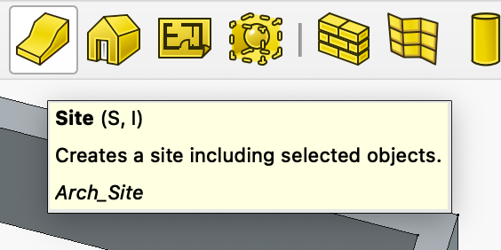

# My comments following youtube video 'FreeCAD BIM Tutorial for Beginners | Create a Garage Building'

See (https://youtu.be/WZHyUBfdgJA?list=PL3wRqQUPtE16yw_c1TnRYJmz37y2ZRTLm)

## BIM workbench rectangle has a 'make face' property

The presenter 'turns off' the face of the first drawn rectangle.

It seems I have to learn how FreeCad presents 'things' in the BIM workbench? To me a rectangle is more the boundary that an area. But on the other hand, I can buy that a rectangle can have a 'face' or not by its 'Make face' property.

## BIM workbench Wall tool

It seems the BIM wall tool can create a 'wall object' from scratch or from one of a 'wire', a 'face' or a 'solid'.

*I wonder what creating a wall from a solid would imply?*

## Alignment of Wall from rectangle refers to walking the rectangle boundary in clockwise direction

If I 'right align' my created wall it seems it is placed 'inside' the rectangle? Whuch in turn sugests that in a rectangle all 'wires' are oriented clockwise around the rectangle center?

## The Line colour of the rectangle is shown ONLY when not selected!

I changed the rectangle 'Line color' to red but the rectangle was still blue!

Only when i clicked outside anything did the red colour show.

## The BIM 'Site' object maps to top level of 'Industry Foundation Classes (Ifc)

See (https://en.wikipedia.org/wiki/Industry_Foundation_Classes)

