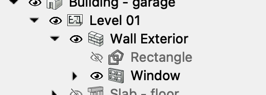

# My comments following youtube video 'FreeCAD BIM Tutorial for Beginners | Create a Garage Building'

See (https://youtu.be/WZHyUBfdgJA?list=PL3wRqQUPtE16yw_c1TnRYJmz37y2ZRTLm)

## BIM workbench rectangle has a 'make face' property

The presenter 'turns off' the face of the first drawn rectangle.

It seems I have to learn how FreeCad presents 'things' in the BIM workbench? To me a rectangle is more the boundary that an area. But on the other hand, I can buy that a rectangle can have a 'face' or not by its 'Make face' property.

## BIM workbench Wall tool

It seems the BIM wall tool can create a 'wall object' from scratch or from one of a 'wire', a 'face' or a 'solid'.

*I wonder what creating a wall from a solid would imply?*

## Alignment of Wall from rectangle refers to walking the rectangle boundary in clockwise direction

If I 'right align' my created wall it seems it is placed 'inside' the rectangle? Whuch in turn sugests that in a rectangle all 'wires' are oriented clockwise around the rectangle center?

## The Line colour of the rectangle is shown ONLY when not selected!

I changed the rectangle 'Line color' to red but the rectangle was still blue!

Only when i clicked outside anything did the red colour show.

## The BIM 'Site' object maps to top level of 'Industry Foundation Classes (Ifc)

See (https://en.wikipedia.org/wiki/Industry_Foundation_Classes)

## The BIM workbench uses a movable 'working plane' for drafting

It seems in the BIM workbench we are to 'draft' as in draw 2D geometry to then use e.g., to create 3D objects.

The presenter in the tutorial shows how to turn on snapping to the working plane.

When snapping to working plane I can draw the rectangle on the top of the external walls and still have the rectangle placed on the working plane at the bottom.

## The 'Slab' tool seems to grow the slab 'out' as in 'down' for a floor?

It seems the slab grows in the direction of the normal of a face. And as we have already established that a rectangle has its edges oriented clockwise around its center, this means the normal if the rectangle will face 'into the clock face' which will be 'down' for a floor based rectangle.

## BIM Object creation will ignore levels?

When I create BIm objects, e.g., a 'slab', it will be placed in the tree root. That is, it will ignore any selected object and will not say place the new object inside a selected level object.

## BIM 'Move Line' tool a bit quirky?

It seem, to move a line:

1. Click on the line in the model tree to select it
2. Click the 'Move' tool

3. Click somewhere in the 3D view (to 'start' the move operation?)
4. Press 'X','Y' or 'Z' to restrict the move along an axis

5. While moving the cursor, the task dialog shows the value moved.

6. Enter the value to move and hit enter.

## BEWARE the 'Home' orientation!

When I added the first internal wall I for some reason managed to rotate the house to be 180 degrees 'wrong' around the up (z) axis!

It seems I can engange 'Home' from the 'View' menu (or fn + left-arrow on mac keyboard)

And it seems the 'Home' orientation is with X to the right and Y like 'in' to the screen (and Z is up)=

So beware the 3D orientation for symetrical objects to get it right from the beginning!

At this stage I had the first interor wall in place.

## Shift-to-focus-move-direction does not work on mac keyboard?

The presenter explains how he starts a move in a dirction and then holds Shift for a while to have Freecad lock in on that axis of movement. But on my Macbook Pro nothing happens when I do this.

Instead, what works, is to start the move, then press 'Y' to lock movement in the Y-axis direction and then press tab until the move dialog selects the 'Length' field an I can enter the exact move amount and hit Enter.

The non-working Shift-to-lock-move-axis may be because I am using the 'Touchpad' Navigation Style? Here the Shift key is used in combination with the touchpad to move my 3D view. 

But it may also be that the key bindings on mac differs from those used by the presenter in the video?

## The Wall-tool does not select the Wall after creation (wrong properties shown)

A couple of times I created a wall and then searched the property pane to adjust the height and width. But I could not find these properties. The reason was that the created wall was not the selected object in the model tree!

So remember: Always select the wall after it has been created to be able to edit its properties.

## Using the Window-tool is quirky

It seems the 'Auto include in host object' option means the window will create an actual opening on the wall it is placed?

Also, The 'Sill height' is the position of the window sill above the wall bottom?

I tried to select the corner edge to place the window in the corner as the presenter said he did. But then my window was placed in mid-air above the wall? 

NOTE: It seems once the winow is placed it is 'dead' in that I cant grab it and move it to some other placement?

The window is also placed *inside* the wall object in the model tree view! This is a little surprising given that walls and slab so far has NOT been placed inside anything?

I have to drag the 'create window' to the corner bottom vertex to have it be placed in the corner.

NOTE: The window is actually on the right side wall. What looks like a window on the left side wall is NOT a window. I can't click there to select anything. *Strange...*

The 'Offset' property is actually the amount of inset of the window into the wall.

## Move and Copy are separate tools

## Beware of scrolling property values!

The window I created somehow ended up at 1496 mm after I had moved it 1500 mm as instrcuted. The reason was that I had somehow set 'H1' property to -4 mm!

I am pritty sure this happened because I scrolled the property window. But when the cursor ends up over a numerical input field, the action changes from scrolling the pane, to scrolling the integer value!

This was hard to find! Also, why does the property allow a negative frame width?

NOTE: There is also no 'reset' what I can see. So if you screw up any property value I don't know how to rescue the sitation back to the defaults?

## I had a hard time get the meassurments correct

To actually select an edge you have to be very careful to not select a face, a wall or the window. The correct way seems to move the cursor close to the edge until the face is no longer selected. Now the edge is probably selected.

Also, once I got the frame width (fixed my neggative H1 property value) I found that the moved distance shows up between the external wall left corner and the outside of the window frame. Quite obvious once I succeeded. But before I had gotten all kinds of strange locking to objetcs and following stramnge measurements...

