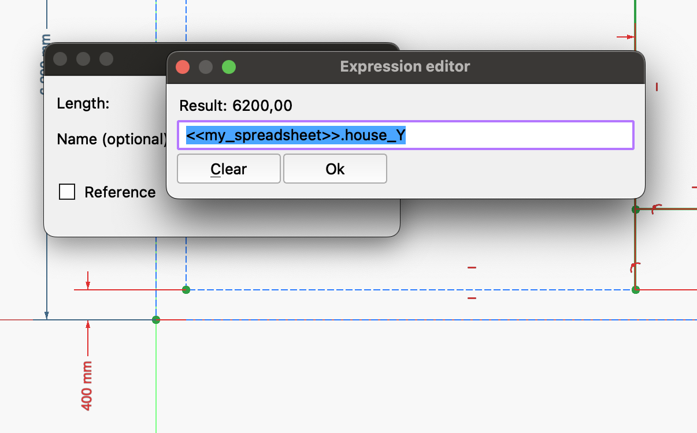

# My comments while modelling for the second time the house in youtube video 'FreeCAD BIM Tutorial for Beginners | Create a Garage Building'

See [https://youtu.be/WZHyUBfdgJA?list=PL3wRqQUPtE16yw_c1TnRYJmz37y2ZRTLm](https://youtu.be/WZHyUBfdgJA?list=PL3wRqQUPtE16yw_c1TnRYJmz37y2ZRTLm)

I created the take_2 model file 'FreeCAD_BIM_Tutorial_for_Beginners__Create_a_Garage_Building_take_2.FCStd'.

## The plan view

The plan view at video 7:55 shows also the wall thickness 400 mm.

Some key properties are:

* Width **X: 8400 mm**, Depth **Y: 6200 mm**
* The external wall is **inside** the 8400x6200 house wall perimeter.
* The external wall thickness is **400 mm**
* The slab thickness is **250 mm**

## Beware 'Snap to the Grid' is its own setting (See icon that looks like a 'hash', kind-of)

I had already forgot the 'Snap grid' setting and icon! Without this setting it is hard to draw the rectangle attached at origo.

## It seems I can use a spreadsheet with alias to cells to control parameters of my house model?

1. I created a spreadsheet in the 'Spreadsheet' workbench.

2. I defined a set of parameters I needed for the external and internal walls.

3. I assigned an Alias to each value (I used the same alias as the text I used in column A)

NOTE: Freecad can NOT read 'names' of cells from the spreadsheet itself!

4. I could now degine a sketch with contstraints that uses the cell values in my spread sheet.

E.g., the Y-axis dimension of the exterior wall was defiend as the value of the cell with alias 'house_Y'.

Note: I initiated the value input with '=' and Freecad opened the expression editor automatically!

This is kind of nice!

Especially as the sketch DOES update when I changed the value in the spread sheet!

...