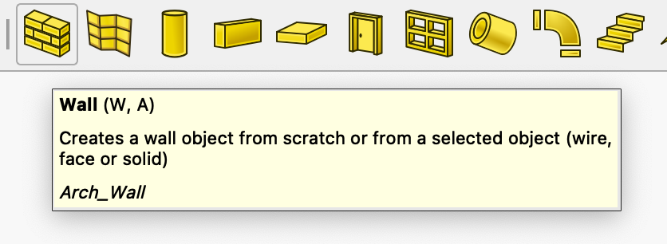
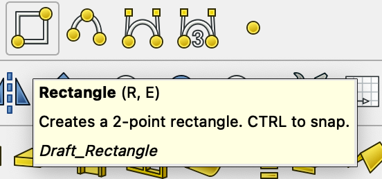
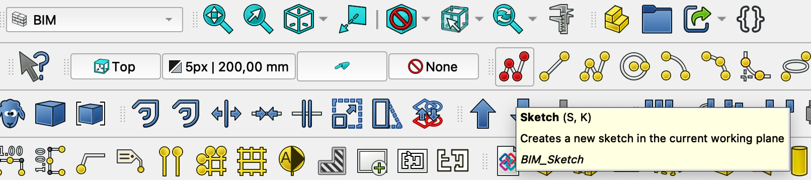
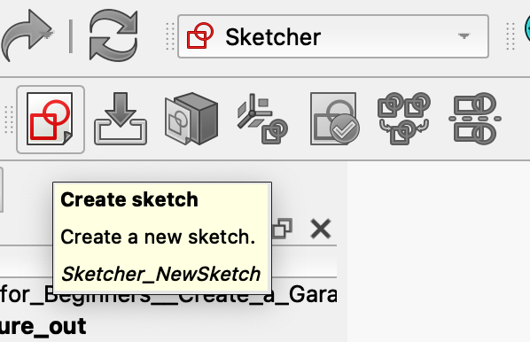
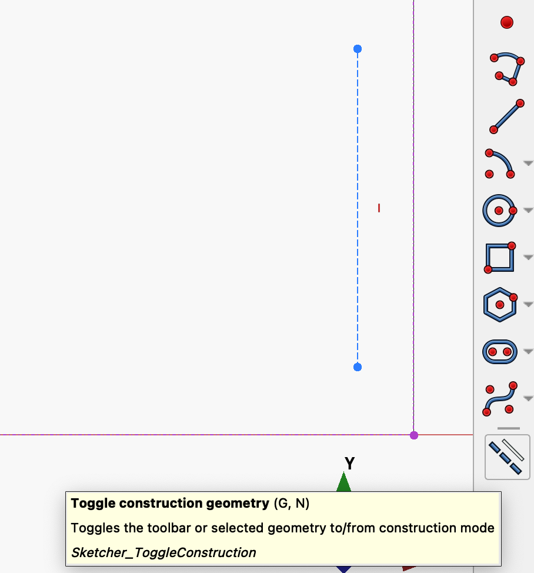
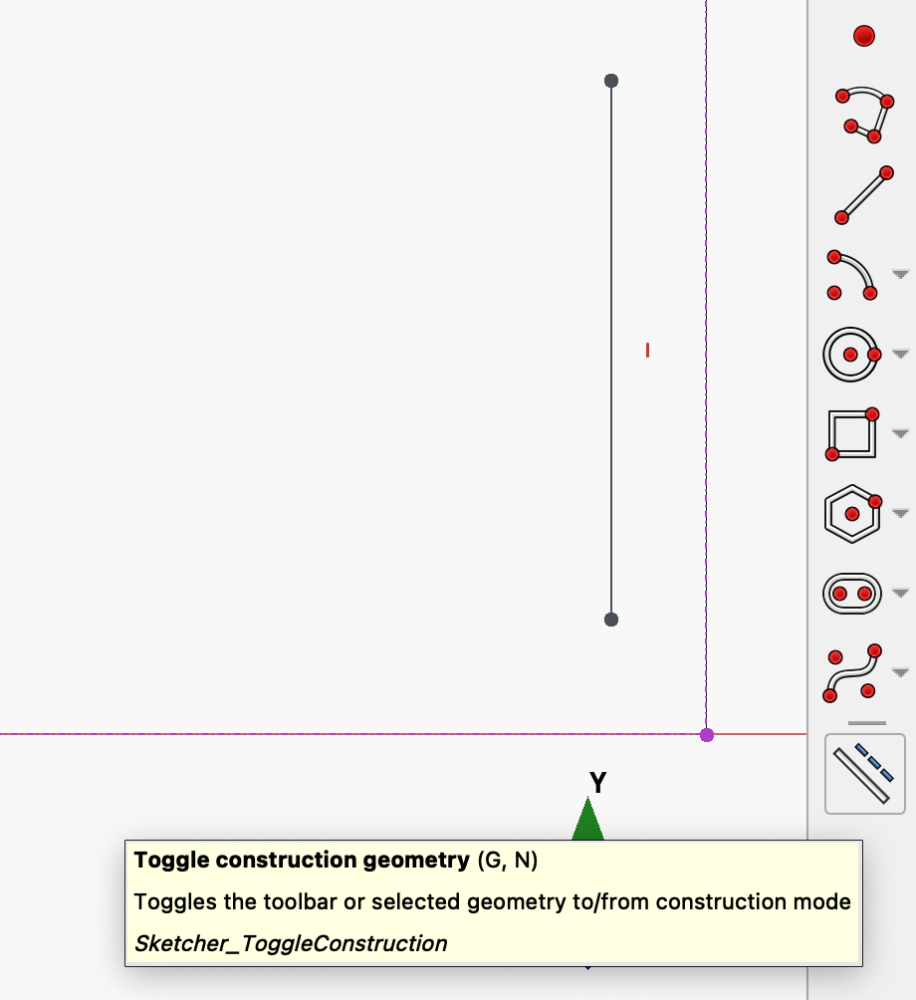
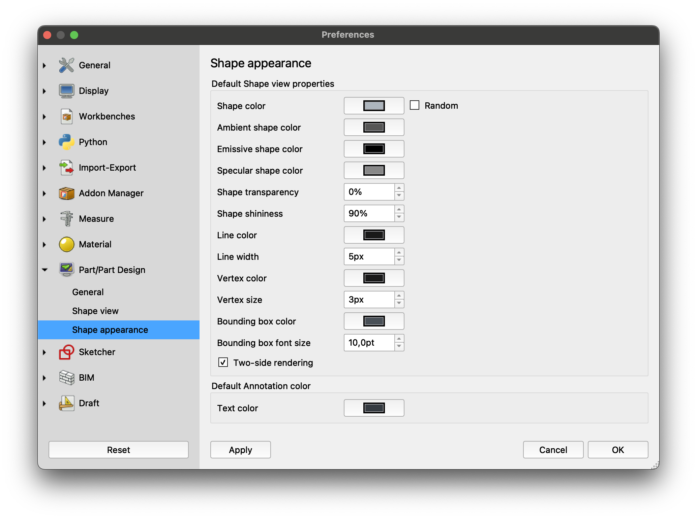
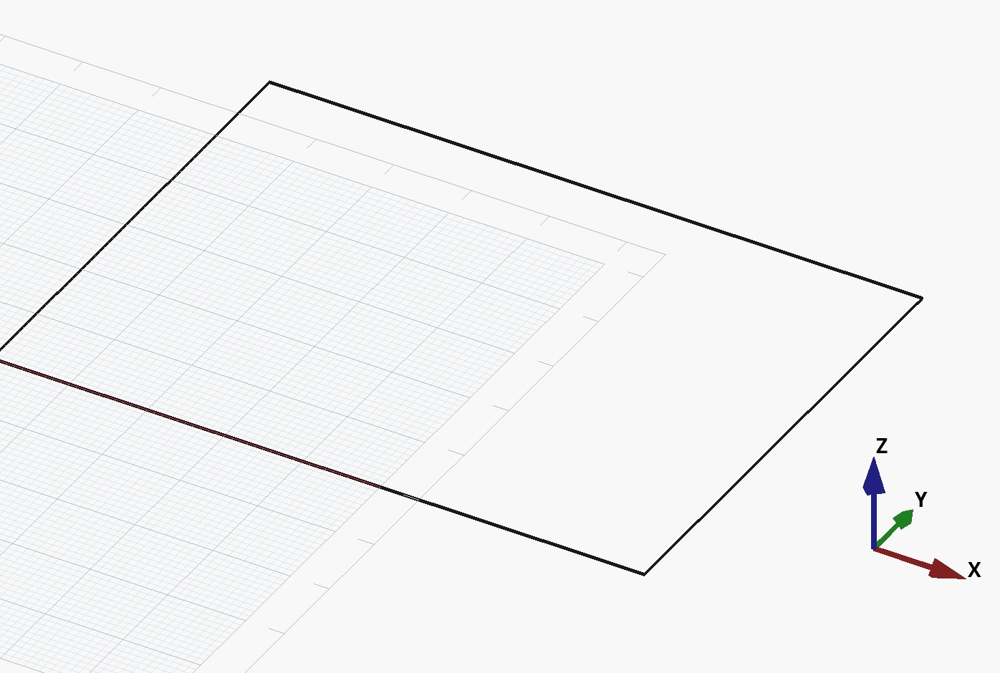

# My poking into Freecad to figure stuff out

I want to understand how Freecad treat thuings under the hood so that I can adjust my expectations and model of what Freecad does. This should make me more productive and less surprised when using Freecad I hope.

See the Freecad file 'FreeCAD_Poke_to_figure_out/FreeCAD_Poke_to_figure_out.FCStd'

## In BIM workbench, can I create a 'Wall' from a sketch?

YES!

1. I switched to 'Sktecher' workbench.
2. I created a Rectangle
3. I Closed the sketch and selected it
4. I Switched to the BIM workbench.
5. I clicked on the 'Wall' tool button

And Freecad created the wall OK!

Conclusion: This seems like a better way to create walls in BIM than to use the BIM workbench 'Rectangle' tool. Because if we use that one we get a rectangle with a face that we need to 'turn off' to make the wall tool be able to use it!

## The BIM workbench 'Sketch' tool is the same as '

The BIM workbench 'Sketch' tool.

Is the same 'tool' as the 'Sketcher' workbench 'Create Sketch'.

## Beware that construction line mode icons are blue

Also note that no icons correspond with the fact that construction lines are rendered as 'dotted'.

And to add to confusion, the 'Toggle construction geometry' icon always shows the 'active' mode as a dotted line (left large line dotted and blue when on. And small roght line dotted and blue when off).

I found out that when the drawing icons are blue, and the 'Toggle construction geometry' icon has the **large line** dotted and blue, then we are in construction line mode.

And when the drawing icons are white, and the 'Toggle construction geometry' icon has the **small line** dotted and blue, then we are in construction line mode.

*Note: It is confusing that the 'contruction line mode' does not correspond with icons that have dotted lines!*

## Beware how hard it is to find the settings for default line width for drawn stuff and while-drawing stuff?

It seems I can affect 'drawn'stuff' with the properties in the Freecad preferences for 'Part / Part Design' and 'Line Width'.

But so far I have fauled to find any settings to make the indicator lines that Freecad shows while a draw e.g., a rectangle. So far they seem to always me 1 pisel and black?

This is a rectangle I created with the preference 'Line Width' of 5 pixels.

