# My poking into Freecad to figure stuff out

I want to understand how Freecad treat things under the hood so that I can adjust my expectations and model of what Freecad does. This should make me more productive and less surprised when using Freecad I hope.

See the Freecad file 'FreeCAD_Poke_to_figure_out/FreeCAD_Poke_to_figure_out.FCStd'

## 'Booting' my understanding from simple 'beam' object

I came up with the idea to create a simple object like a 'beam' and ask the following.

1. How many ways are there to model a 'beam'?
  * I imagine I can create a beam in two wokrbenches?
    (The 'Part Design' and/or the 'Part' workbench)

### What is a 'Model' and what do I get when I do <File>/<New>?

Am I stupid or is FreeCad user interface just vauge? I wanted to try ways to create a beam and opened the file 'FreeCAD_Poke_to_figure_out.FCStd'. I am confused about the semantics of this file? Is this something like a 'project file' in that it aggregates 'stuff' beloning to the same project? I know it is something something zipped?

I tried <File>/<New> and got a new top node in the model tree.

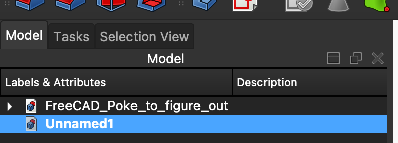

The FreeCAD documentation is vauge about the FCStd-file [File Format FCStd](https://wiki.freecad.org/File_Format_FCStd):

```text
The FreeCAD Standard file format (.FCStd) is FreeCAD's main file format. It is a compound format, supports compression and embedding of different kinds of data.
```

Huh?

So what I need to know is the 'semantics' for this file. So I know what to put in it? When to create a new one? What consequencies two or more files have on my work flow? Can I reference data in one FCStd-file from 'stuff' in another FCStd-file? And so on?

I need to come back to this later. For now I create my beam under the top node I got in my 'model' when doing <File>/<New>.

- When do I need to save?
- Can I save with my top node named 'Unnamed1'?
- What happens if I quit without saving after <File>/<New>?

Well, I could <FreeCAD-...>/<Quit freecad> without any pop-up or errors.

And When I opened my FCStd-file again my new model top node 'Unnamed1' was GONE!

AHA! The top-nodes in the model-tree ARE separate FCStd-files!

I named my 'new' thing 'beam_bootstrap'.

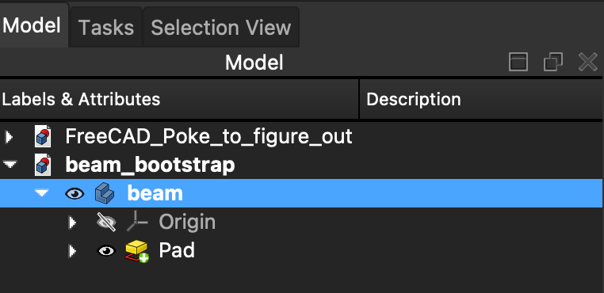

Then <File>/<Save> does:

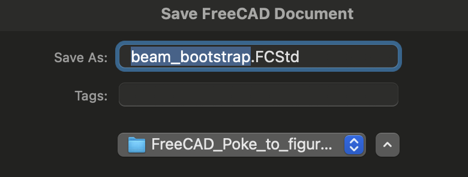

*sigh* (VAUGE...)

But ok. I can adapt!

I have to remember to later try to referense 'stuff' in another FCStd-file to see if I can?

- Are there other types of files to save other 'things'?

### Why can I create a 'Part' under (inside) a 'Part Design' thing?

I used the 'Part Design' workbench to sktech and extrude a 'thing' I labelled 'part_design_beam'.

I then switched to the 'Part' workbench and created a 'cube' (that I named 'part_cube_beam') with the same dimesnions as my 'part_design_beam'.

I now have 'part_cube_beam' as a member node under the 'part_design_beam'?!

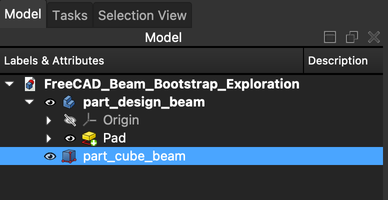

What does this even mean?

### Why can I create a 'Part workbench cube' beam paralell with 'Part design' beam?

If I first use Part workbench to create a cube-as-beam and then the Part design workbench to extrude a sketch into a beam - then I get the part-beam and part-design-beam as separate nodes. What does this mean? 

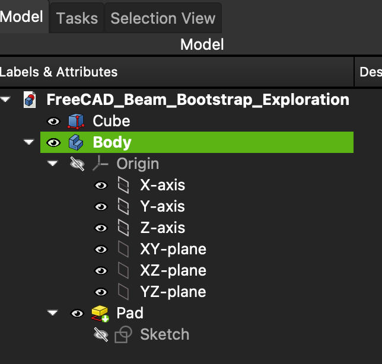

### FEM analysis on single beam

I used youtube video [FreeCAD FEM Workbench | Basics In 15 Minutes | Beginners Tutorial](https://youtu.be/YJd78HWdK1M) to just get directions on what vuttons to press and in what order to apply a FEM analysis on one of my beams.

I was able to get an analysis and view of the beam displacement.

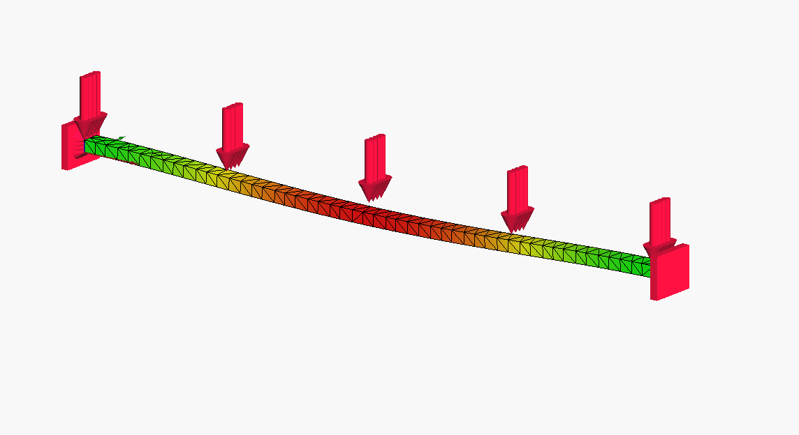

So what did NOT behave as I expected it to?

1. We need a 'body' open in the editor.
   (I failed to import, link or do anything of the sort to bring a 'thing' in for analysis)
2. We need (?) to create an 'analysis' in the same document as the body?
   (This is what the youtube video show us to do)

We need to create the following nodes in the nodel tree.

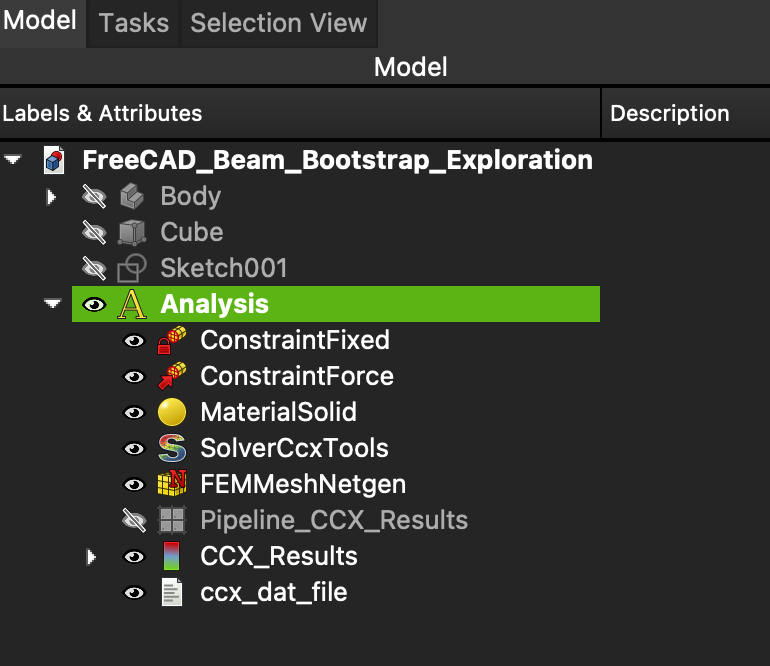

* The top 'Analysis' container node (FEM workbench)
* The ConstraintFixed sub-node (FEM Workbench define what face is fixed)

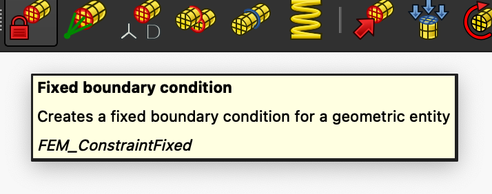

  - Quirk: I need to have a 'body' open in the view to have something to select off on.
  - Quirk: I need to click 'add' and then a face (not the other way around)
  - Quirk: When I select the end-face of my beam I get a 'box' added!
           (Seems to be a view of something 'fixed'?)

 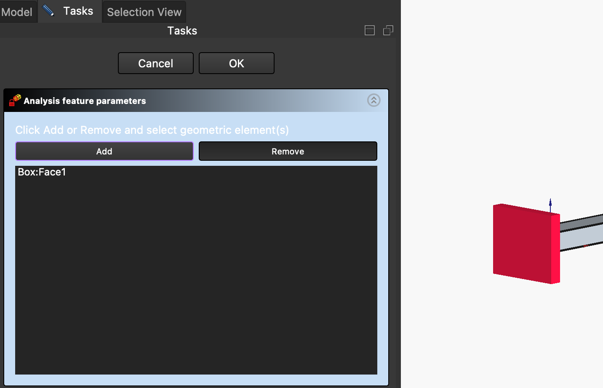 

* The ConstraintForce sub-node (FEM Workbench define what and where forces are applied)

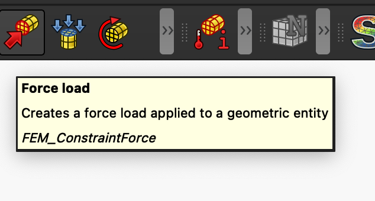

  - Quirk: I get several grouped forced applied in the view
           (Why five and why there?)
  - Quirk: The 'force' is 500 without dimension (It is not Newton, more below)?
  - Quirk: The forces are by defult up (I needed to click 'reverse')
  - Quirk: I edietd force to 1000 0000 but the main dialog still showed 500.
           (But my 1000 000 value was used ok - confusingly...)

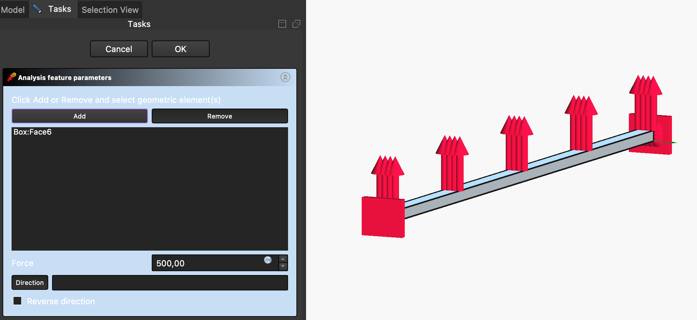

  - Quirk: I failed to use the opposite face as 'direction' to reverse the direction

  - Quirk: I tried the 'Preassure load' instead but it stills looks like five point forces?
           (Although the arrows are now blue to konfuse me even further...)

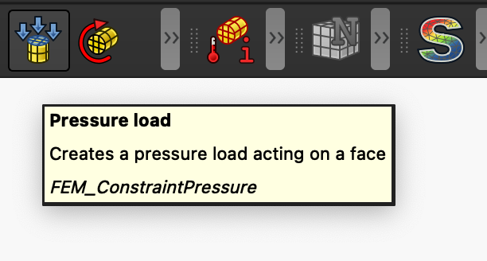  

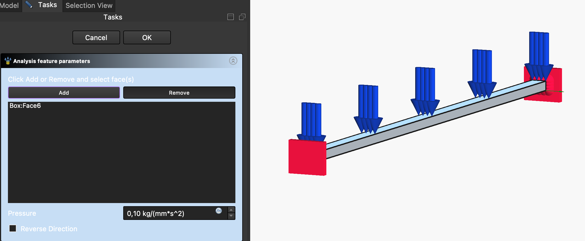

  - Quirk: The 'pressure' is defaulted to 0,1 kg / (mm*s^2)
           (I suppose it is from F = m*a and P = F/A?)
           (F dimension can be expressed as kg*m/s^2)
           (Thus P dimenseion becomes kg*m/(m^2 * s^2) which is kg / (m*s^2))
           (But why use this dimension? ANd why mm to get everyting a factor 1000 larger?)

* The MaterialSolid (FEM workbench define the material of our 'body' go analyse)

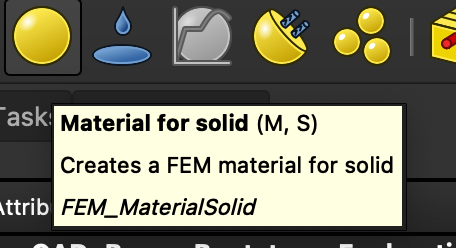

  - Quirk: The created 'material' node does not show what mayterial it is set to

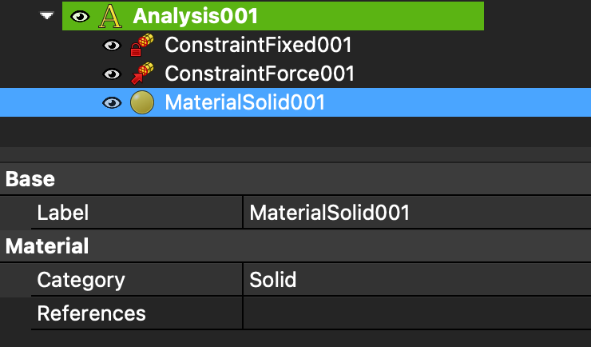  

* The SolverCcxTools node (FEM workbench define what processor to implement FEM)

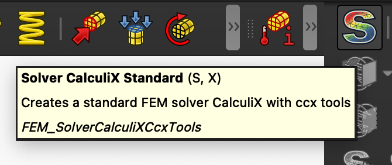

* The FEMMeshNetgen node (FEM workbench FEM triangulation of the body to analyse)

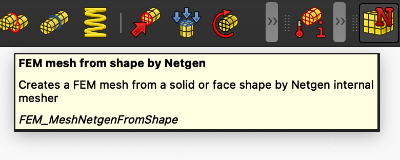

  - Quirk: I needed to select and make visible the body I wanted to analyse
           (Again, no concept of 'importing' into the analysis)
  - Quirk: The created mesh refers to my selected 'thing' as the 'Shape'

 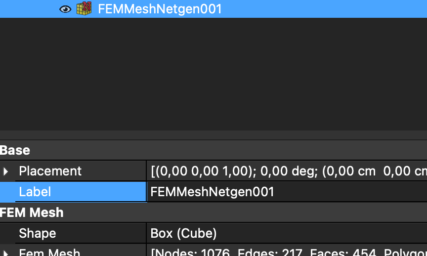 

 * The CCX_Results and ccx_dat_file (SolverCcxTools node 'write .inp-file' and then 'Run CalculiX)

 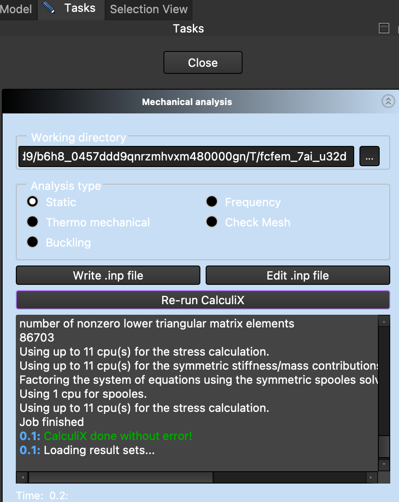

Finally, to actually see the result I need to open the CCX_Results node.

- Quirk: The 'Displacement' section default to a max factor 100 instead of 1
         (Maybe good for seeing very small displacements by factoring them up?)
         (For my 6 cm over 250 cm it was just confusing with the factor 100!)

So far I at least got the pipeline to work. But I still have things to figure out.

- How do I apply a FEM analysis to building elements of my house?
- Do I need to transform my assembled beams into solids first?
- And if so, how do I model fasteners (joint strength and behaviour)?
- I failed to apply FEM so my experiment 'assembly'.
  (An assembly can't be used as something I can turn into a FEM mesh for analysis?)

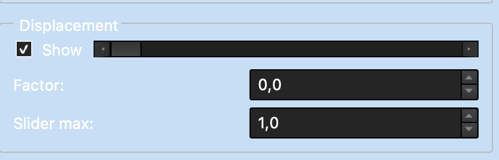

### How can I render 'tings' from FreeCad in Blender?

I would like to render my house designs in blender. This seems to be possible. But how can I understand how this works to chose how to do i myself?

I watched [FreeCAD 1.0 x Blender : Render and Animate your 3D CAD files - Complete Beginner Tutorial](https://youtu.be/6amHcXHxCa8).

In the video the presenter exports an assembly! So that is possible.

1. Seelct assembly (all parts becomes selected / blue in the view port)
2. Do File/Export
3. The video seems to sugest we shall export in some 'mesh format' (at around 1:20 into the video)
  Sugested formats in the video are:
  - OBJ (Remeshed)
  - PLY
  - STL
  - GLTF
4. Export as GLTF (to try the video shown way)
  - Quirk: I get two files (a bin-file and the gltf-file)
           What is the bin-file? 
5. Open the file gltf-file in blender
  - Quirk: I can't ask macOS to use Böender to open the file.
           Blender does start but ignores the file

  - In Blender do File/Import/gltf 2.0

I now got my assembly in Blender view port and model tree.

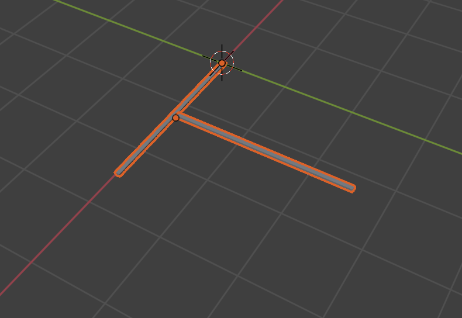

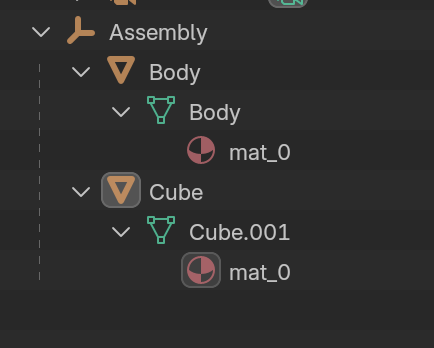

So now we have a way to operate on FreeCAD assemblies in Blender. Is this sufficient?

- Will my house be a set of 'things' I define in FreeCAD assembly workbench?
- Will FreeCAD Assembly -> GLTF -> Blender be a sufficient pipeline to render my house designs?

### Can I create an 'HDR' of the surroundings where my house will be built?

The youtube video [FreeCAD 1.0 x Blender : Render and Animate your 3D CAD files - Complete Beginner Tutorial](https://youtu.be/6amHcXHxCa8) shows how to use an HDR to get 'good lightning' but also indicates that an 'HDR' provides a surrounding 'world' that Blender will render my house in!

I downloaded the free HDR [HDRIs / Outdoor / Charolettenbrunn Park](https://polyhaven.com/a/charolettenbrunn_park).

- Blender quirk: To render my house I go to the Blender tab 'Shading' (Not 'Render')!

At around 9:50 into the youtube video the presenter shows how to configure Blneder to use an HDR to render my 'thing' in.

I succeeded to use my free downloaded HDR to view my FreeCAD assembly in!

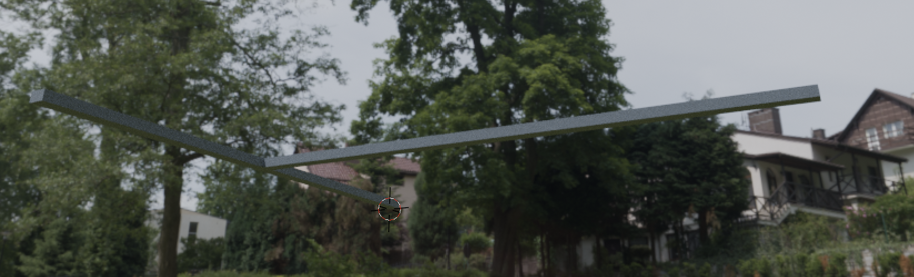

As of now just my simpel two-beams-as-a-cross assembly with no material applied in Blender.

This is EXCITING! If I can find a usable and simple way to catch my house location as an HDR with correct scale - then I actually CAN model my house in FreeCAD and then render it 'on location' with the HDR!

## In BIM workbench, can I create a 'Wall' from a sketch?

YES!

1. I switched to 'Sktecher' workbench.
2. I created a Rectangle
3. I Closed the sketch and selected it
4. I Switched to the BIM workbench.
5. I clicked on the 'Wall' tool button

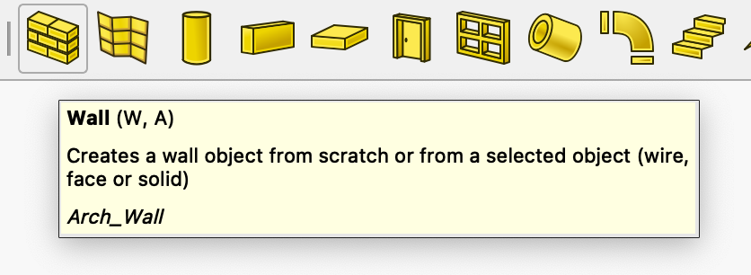

And Freecad created the wall OK!

Conclusion: This seems like a better way to create walls in BIM than to use the BIM workbench 'Rectangle' tool. Because if we use that one we get a rectangle with a face that we need to 'turn off' to make the wall tool be able to use it!

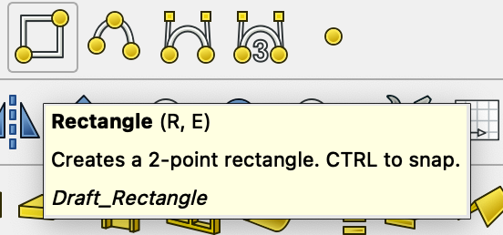

## The BIM workbench 'Sketch' tool is the same as 'Create Sketch' in 'Sketcher' workbench

The BIM workbench 'Sketch' tool.

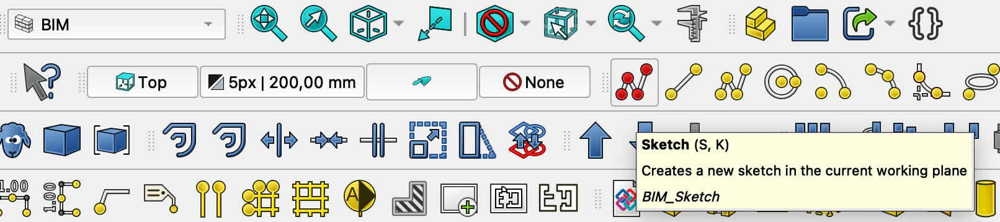

Is the same 'tool' as the 'Sketcher' workbench 'Create Sketch'.

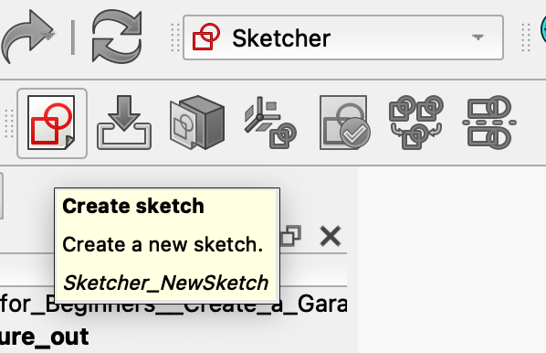

## Beware that construction line mode icons are blue

Also note that no icons correspond with the fact that construction lines are rendered as 'dotted'.

And to add to confusion, the 'Toggle construction geometry' icon always shows the 'active' mode as a dotted line (left large line dotted and blue when on. And small roght line dotted and blue when off).

I found out that when the drawing icons are blue, and the 'Toggle construction geometry' icon has the **large line** dotted and blue, then we are in construction line mode.

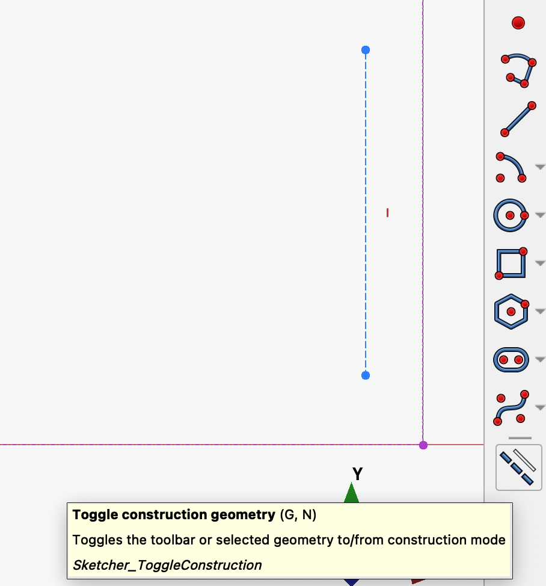

And when the drawing icons are white, and the 'Toggle construction geometry' icon has the **small line** dotted and blue, then we are in construction line mode.

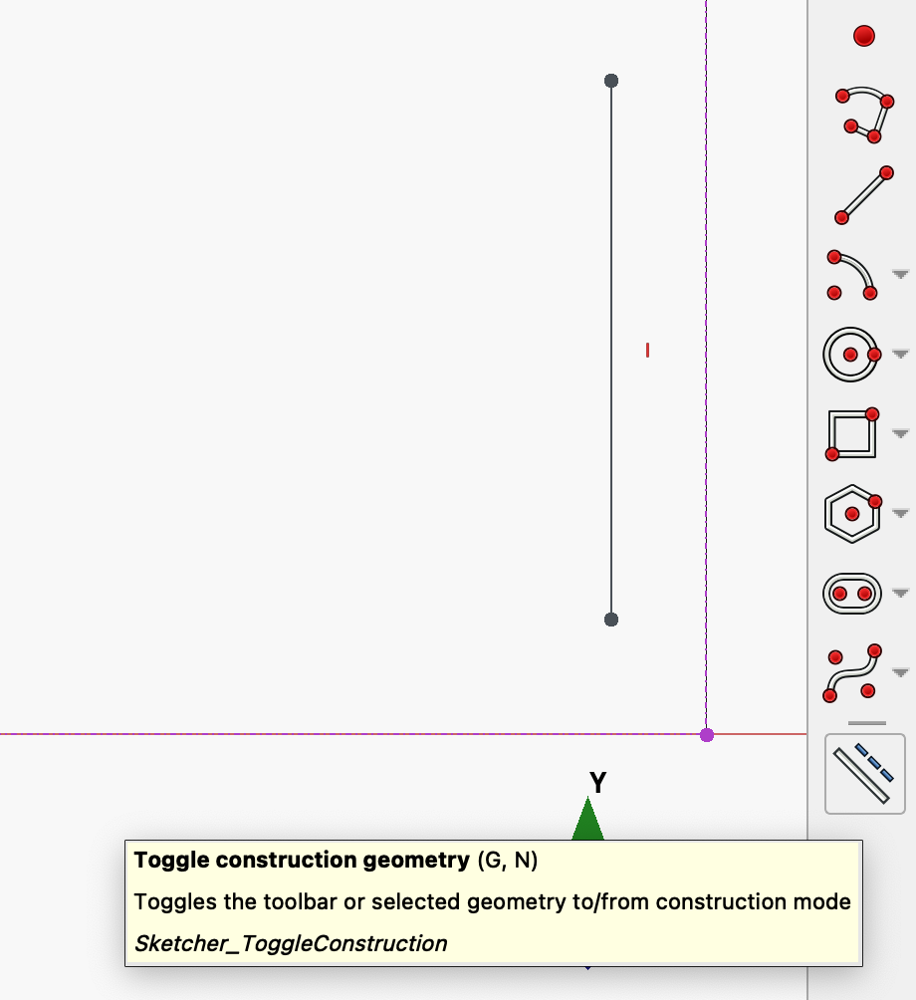

*Note: It is confusing that the 'contruction line mode' does not correspond with icons that have dotted lines!*

## Beware how hard it is to find the settings for default line width for drawn stuff and while-drawing stuff?

It seems I can affect 'drawn'stuff' with the properties in the Freecad preferences for 'Part / Part Design' and 'Line Width'.

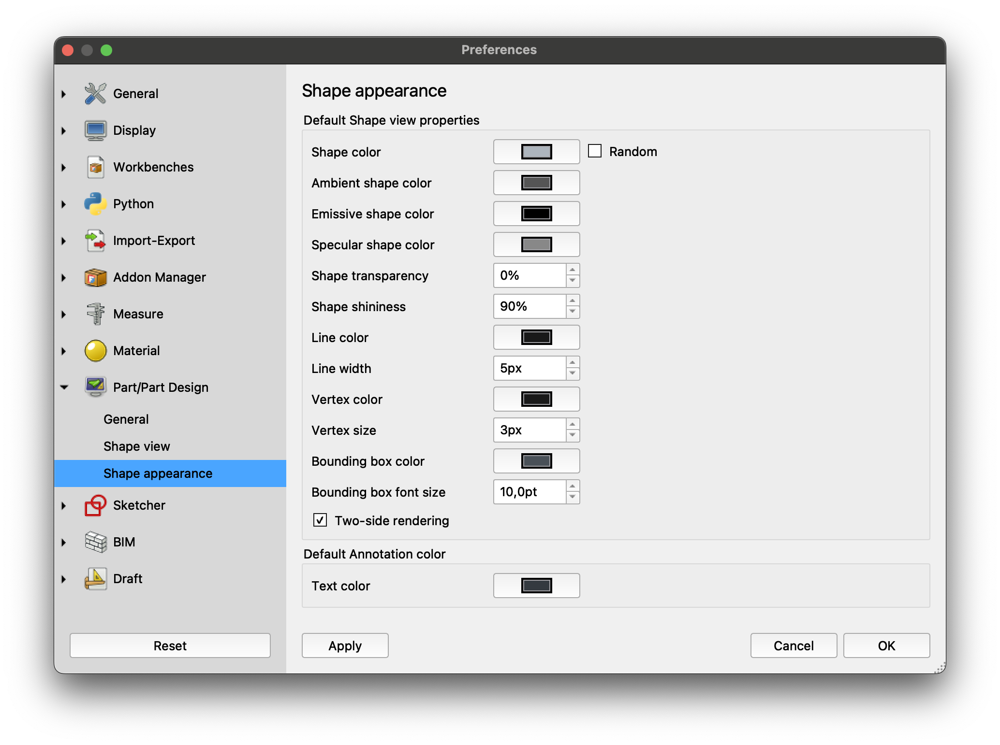

But so far I have fauled to find any settings to make the indicator lines that Freecad shows while a draw e.g., a rectangle. So far they seem to always me 1 pisel and black?

This is a rectangle I created with the preference 'Line Width' of 5 pixels.

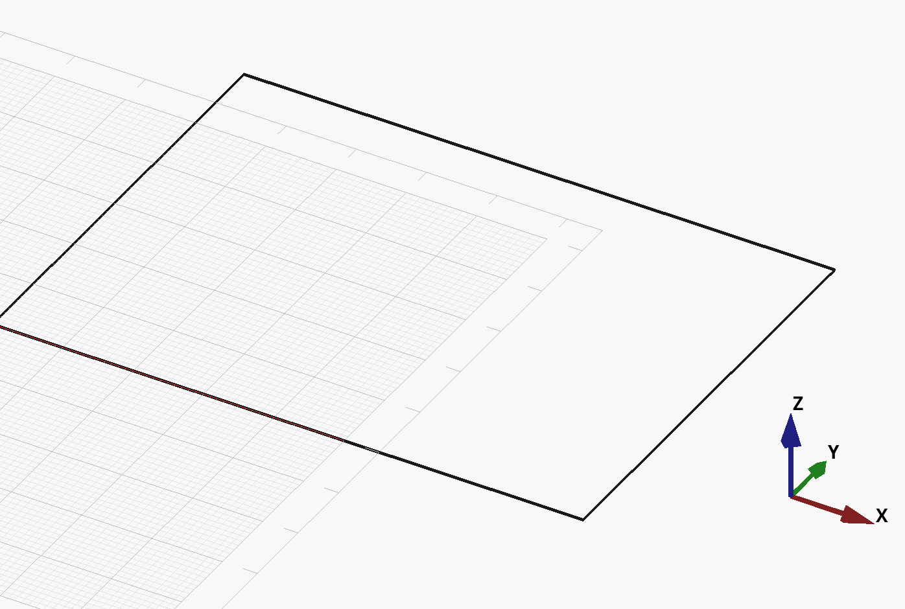

## Can I create both Walls and a slab from the same sketch?

Yes!

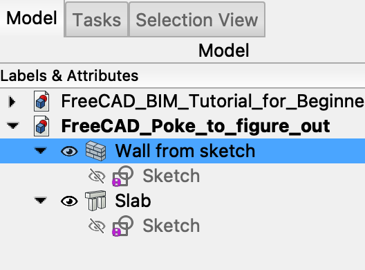

It seems the 'sketch' referenced (shown inside) the Wall tree node is **the same one** as the one referebnced (shown inside) the slab?

At least, if I make the sketch visibe, then the sketch inside the wall and the sketch inside the alb are both made visible.

Also, when I rename the sketch inside the slab to 'sketch - perimeter' then the label of 'both' sketches changes together.

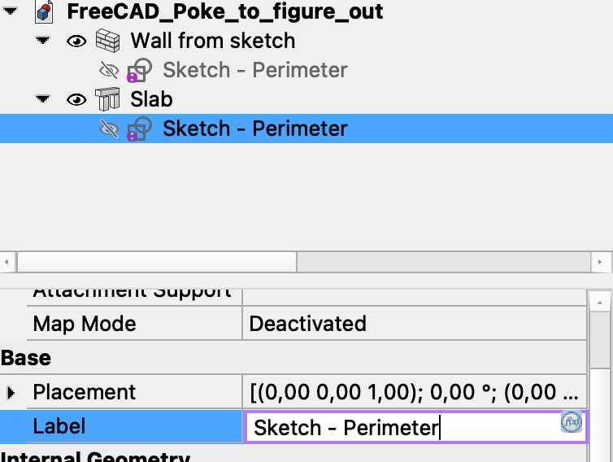

I conclude the object shown inside the wall and slab is a **reference** to the same sketch instance?!

## Can we snap internal walls to a floor sketch?

YES!

I created a sketch 'Sketch - internal walls' and projected the external walls onto it (using the 'Create external geometry' tool to get the inside reference of these walls).

I could now place two lines to use to create the internal walls. 

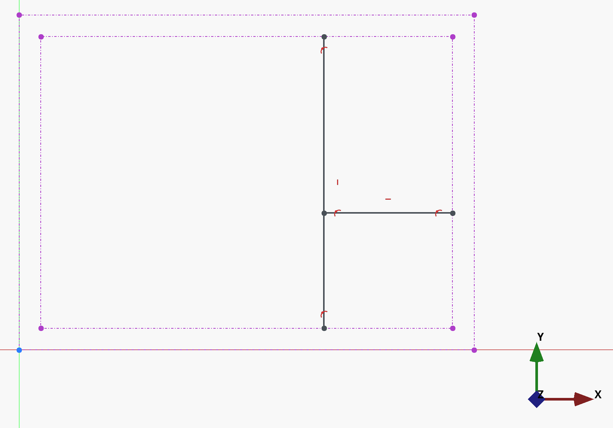

And using the 'Wall' tool on this sketch got me some innetr wall ok.

NOTE: BE sure to 'Create external geometry' in the 'Constrction geometry' mode (to make the external wall reference lines 'virtual' = not used by the create wall tool later on).

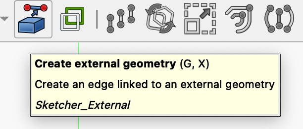

The external geometry mode is indicate with blue geometry icons.

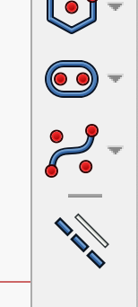

## Can I snap windows to a sketch on the wall?

YES! But the sketch must NOT be referencing the wall through 'external geometry'!

I created this sketch. Where the perimeter is 'external geometry' from the existing wall.

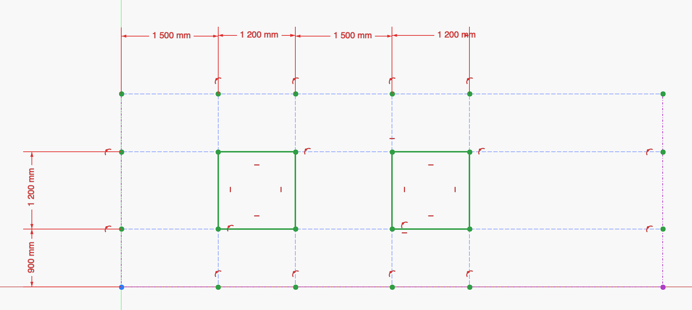

Now I was able to place a window that snapped to the rectangles on the sketch that I hade drawn where the windows should go.

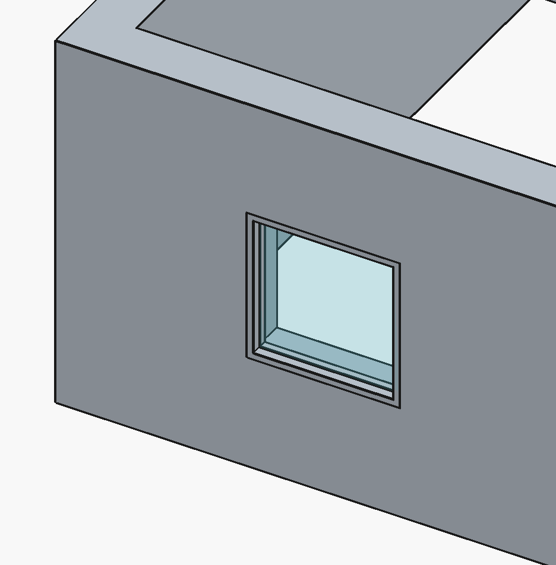

BUT - When the window snapped into place this sketch (and the sketch I had defined for the internal walls) **broke**!

Maybe the 'create window' tool renames the topology of the wall? And if so, then this breaks the external geometry projection of both the internal wall and external wall face sketches? As they both project the external wall onto them and uses these references for drawings?!

**Beware** - The 'Sketch' tool in the BIM workbench seems to snap to the wroking plane? I was unable to create a sketch on the wall surface (it was placed on the floor by itself and without asking)? 

But - if I switched to the 'sketcher' workbench I could select a wall face and create a sketch onto that face seemingly ok.

Conclusion: It seems I may be able to snap window in place as defined by a sketch as long as the sktech does not break when the wall is mutated by the inserted window?

## Can I define named parameters and have my sketch use such parameters?

YES! I can use a 'spreadsheet' and give cells an Alias. Then I can use this alias as an 'expression' for other freecad properties.

1. I Create a 'Spreadsheet' in the 'Spreadsheet' workbench

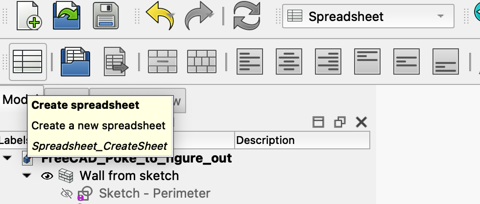

2. I assigned an Alias to cell A1

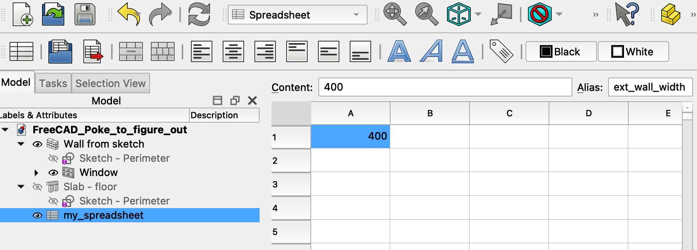

3. Now I could use this value in my Wall 'Width' property

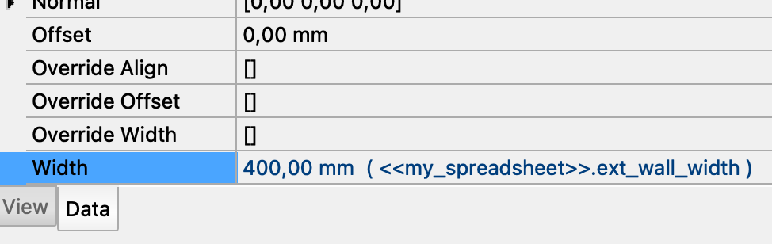

Note: I entered this expression by starting the input with '='. This triggered Freecad to open an 'Expression editor'!

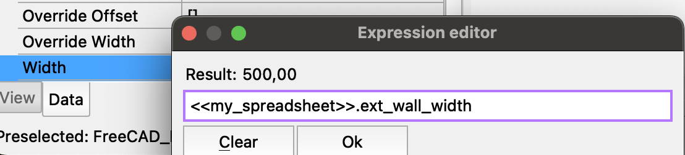

## Will a sketch on a wall face break when I place windows on the wall

NO! The sketch stays intact and ok!

I made this sketch of the back wall of a house model in 'take_2' of the gaerage building tutorial (See TAKE_2.md).

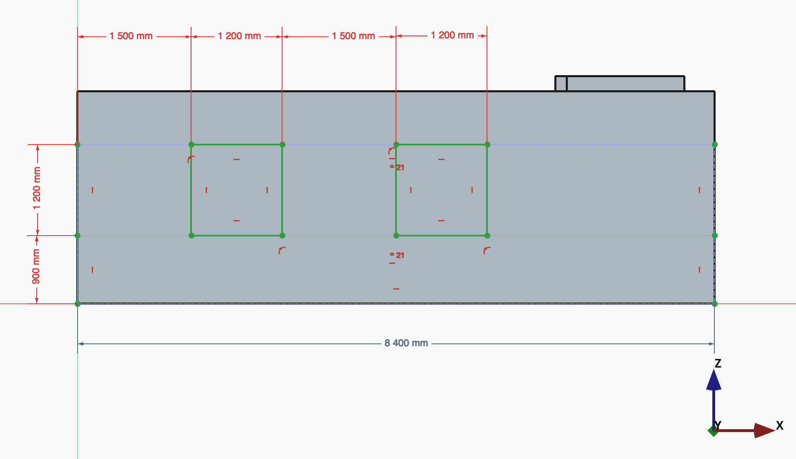

This sketch depends on values in a spreadsheet. And it does NOT depend on any projected dimensions from the wall itself.

Question is, can I use this sketch to place windows on the wall without this sketch breaking?

## Can I place windows on a wall by snapping to a sketch on the wall?

YES! As long as the sketch does not project any dimensions from the wall.

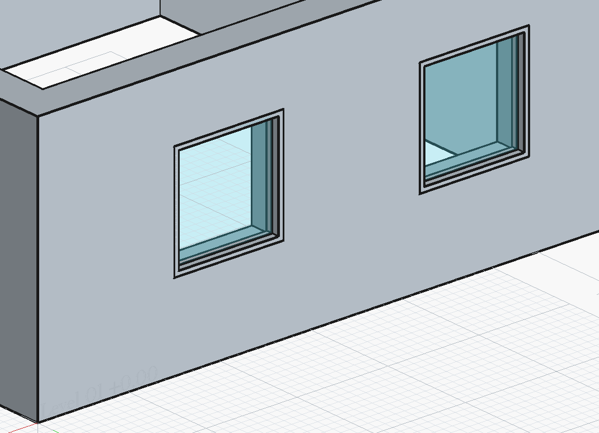

## Will windows placed by snapping to a sketch on the wall move with changes to the sketch?

NO! I changed the distance between two windows I placed with the sketch above. BUT - the wondow I placed by snapping to the sketch did NOT move!

**Conclusion: Window placement by snapping to a sketch does NOT introduce and placement constraints.**

## Will windows placed on a wall move if the wall placement changes?

NO! The windows seems to be placed at absolute positions in space?

Here is what happens if I move the right side wall with a window on it. It will be left hanging in thin air!

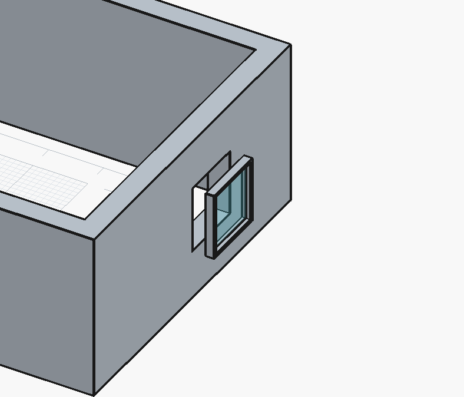

## Can I make the axis placement of a door be an expression and even a value from my spreadsheet?

NO! The placement of a door (and this implicitly any BIM object?) must be a constant value!

You know, these BIM objects seems getting less and less usable? I suppose I have to just accept that BIM dsign is a one-shot operation? Or at least, any changes I must do them manually?!