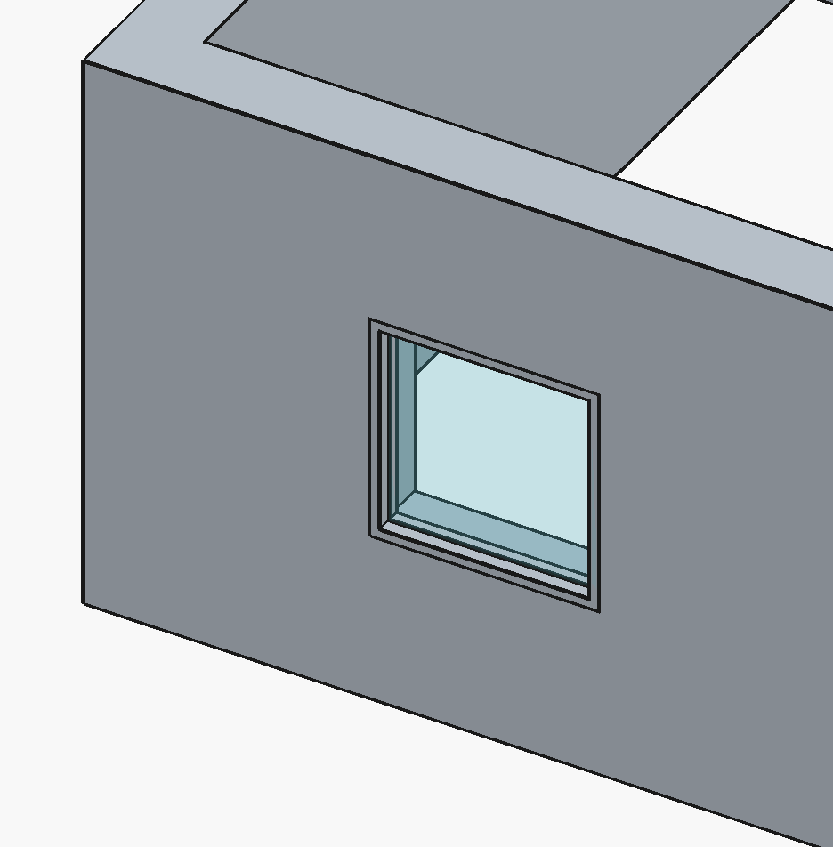
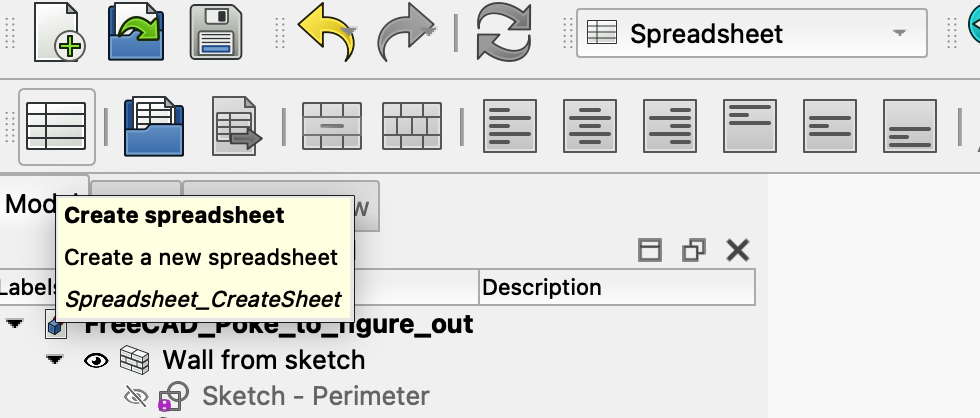
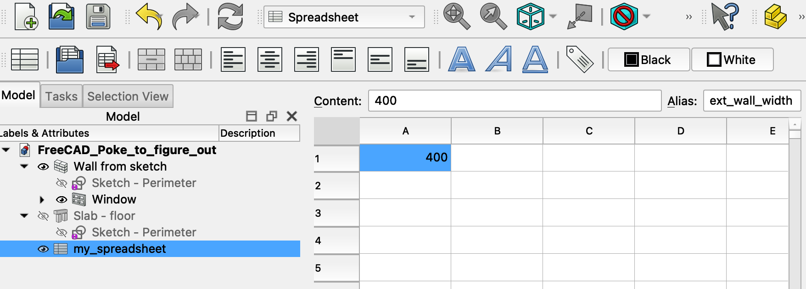
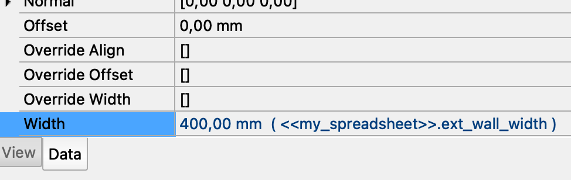
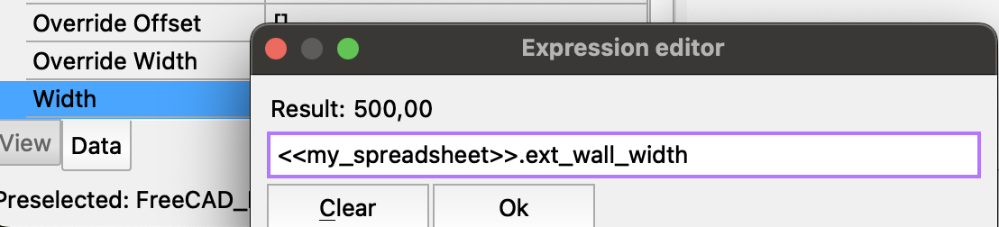

# My poking into Freecad to figure stuff out

I want to understand how Freecad treat thuings under the hood so that I can adjust my expectations and model of what Freecad does. This should make me more productive and less surprised when using Freecad I hope.

See the Freecad file 'FreeCAD_Poke_to_figure_out/FreeCAD_Poke_to_figure_out.FCStd'

## In BIM workbench, can I create a 'Wall' from a sketch?

YES!

1. I switched to 'Sktecher' workbench.
2. I created a Rectangle
3. I Closed the sketch and selected it
4. I Switched to the BIM workbench.
5. I clicked on the 'Wall' tool button


And Freecad created the wall OK!

Conclusion: This seems like a better way to create walls in BIM than to use the BIM workbench 'Rectangle' tool. Because if we use that one we get a rectangle with a face that we need to 'turn off' to make the wall tool be able to use it!


## The BIM workbench 'Sketch' tool is the same as '

The BIM workbench 'Sketch' tool.


Is the same 'tool' as the 'Sketcher' workbench 'Create Sketch'.


## Beware that construction line mode icons are blue

Also note that no icons correspond with the fact that construction lines are rendered as 'dotted'.

And to add to confusion, the 'Toggle construction geometry' icon always shows the 'active' mode as a dotted line (left large line dotted and blue when on. And small roght line dotted and blue when off).

I found out that when the drawing icons are blue, and the 'Toggle construction geometry' icon has the **large line** dotted and blue, then we are in construction line mode.


And when the drawing icons are white, and the 'Toggle construction geometry' icon has the **small line** dotted and blue, then we are in construction line mode.


*Note: It is confusing that the 'contruction line mode' does not correspond with icons that have dotted lines!*

## Beware how hard it is to find the settings for default line width for drawn stuff and while-drawing stuff?

It seems I can affect 'drawn'stuff' with the properties in the Freecad preferences for 'Part / Part Design' and 'Line Width'.


But so far I have fauled to find any settings to make the indicator lines that Freecad shows while a draw e.g., a rectangle. So far they seem to always me 1 pisel and black?

This is a rectangle I created with the preference 'Line Width' of 5 pixels.


## Can I create both Walls and a slab from the same sketch?

Yes!


It seems the 'sketch' referenced (shown inside) the Wall tree node is **the same one** as the one referebnced (shown inside) the slab?

At least, if I make the sketch visibe, then the sketch inside the wall and the sketch inside the alb are both made visible.

Also, when I rename the sketch inside the slab to 'sketch - perimeter' then the label of 'both' sketches changes together.


I conclude the object shown inside the wall and slab is a **reference** to the same sketch instance?!

## Can we snap internal walls to a floor sketch?

YES!

I created a sketch 'Sketch - internal walls' and projected the external walls onto it (using the 'Create external geometry' tool to get the inside reference of these walls).

I could now place two lines to use to create the internal walls. 


And using the 'Wall' tool on this sketch got me some innetr wall ok.

NOTE: BE sure to 'Create external geometry' in the 'Constrction geometry' mode (to make the external wall reference lines 'virtual' = not used by the create wall tool later on).


The external geometry mode is indicate with blue geometry icons.


## Can I snap windows to a sketch on the wall?

YES! But the sketch must NOT be referencing the wall through 'external geometry'!

I created this sketch. Where the perimeter is 'external geometry' from the existing wall.


Now I was able to place a window that snapped to the rectangles on the sketch that I hade drawn where the windows should go.



BUT - When the window snapped into place this sketch (and the sketch I had defined for the internal walls) **broke**!

Maybe the 'create window' tool renames the topology of the wall? And if so, then this breaks the external geometry projection of both the internal wall and external wall face sketches? As they both project the external wall onto them and uses these references for drawings?!

**Beware** - The 'Sketch' tool in the BIM workbench seems to snap to the wroking plane? I was unable to create a sketch on the wall surface (it was placed on the floor by itself and without asking)? 

But - if I switched to the 'sketcher' workbench I could select a wall face and create a sketch onto that face seemingly ok.

Conclusion: It seems I may be able to snap window in place as defined by a sketch as long as the sktech does not break when the wall is mutated by the inserted window?

## Can I define named parameters and have my sketch use such parameters?

YES! I can use a 'spreadsheet' and give cells an Alias. Then I can use this alias as an 'expression' for other freecad properties.

1. I Create a 'Spreadsheet' in the 'Spreadsheet' workbench



2. I assigned an Alias to cell A1



3. Now I could use this value in my Wall 'Width' property



Note: I entered this expression by starting the input with '='. This triggered Freecad to open an 'Expression editor'!



It seems I should also be able to create a sketch. And then on that sketch draw 'stuff' and define contraints.

Then I should be able to use (a python?) expression to refer a constraint value in this specific sketch as a value expression for other properties in Freecad?

```pyhon 
Sketch.<SketchName>.Constraints.<ConstraintName> 
```
