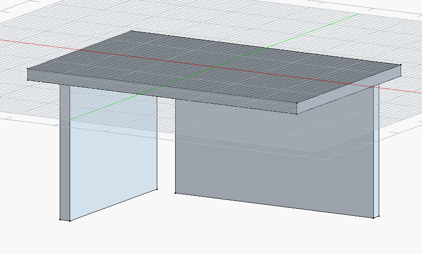
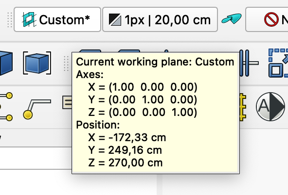

# freecad-playground
An open repository as a playground for possible freecad projects for play, learn and iterate on ideas

## My experience doing \<Help>/\<BIM Tutorial>

### Confusing 3D view after changing 'Current working plane'
After I have Changed the 'Current working plane' the 3D views looks like my 3D model has been translated! 

This is beacuse I am used to having the grid at a fix refernce plane like the x-y-plane. So when I place the working plan say at the top of the walls - it looks like the walls now are placed under the x-y-plane. I suppose you can get used to this but for now I have to learn to understand this.

