# My notes from doing youtube tutorial "FreeCAD 1.0 Ultimate Beginners Crash Course in 1 hour for 3D printing CAD Lesson / Tutorial"

See https://youtu.be/ZPsLhvgU8kc 

## On macOS you 'Home' the 3D view with key 'Fn' + 'Arrow Key Left'

There is now 'Window' key on a Macbook pro keyboard. So to 'Home' the 3D view Freecad uses 'Fn' + 'Arrow Key Left'.

## A 'Body' is a *thing* that contains 'Parts'

So, Freecad semantics is a bit opaque. But it seems a 'Body' is something in Freecad that cointains 'parts'?

## It seems the 'Part Design' workbench provides tools to *design* the parts of a 'Body'? 

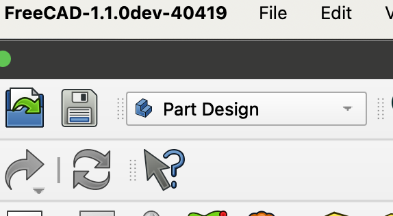

...

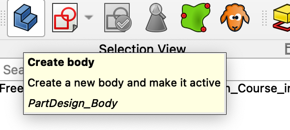

## We can create a 'Sketch' within the 'Part Design' workbench (although a 'Sketch' is kind of a '2D Draft' *thing*)

I am still confused about what a 'Workbench' actually is? I am at least able to create 2D sketches in the 'Part Design' workbench although they are 2D drawings and one could be misstaken that you would need to go to the 'Draft' workbench for this? But no, that is not how it works.

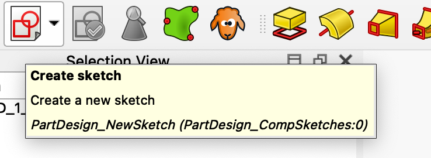

## The 'View Sketch' tool button seems handy to get back to a good view of current open *sketch*?

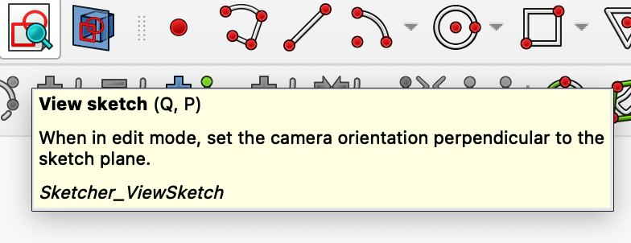

AHA! When I click the 'Create sketch' tool button I *actually go* to a '

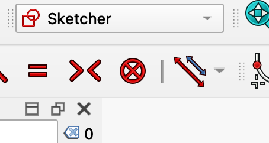

## The cursor coordinates shows only after the 'Create Rectangle' (any create?) tool is activated

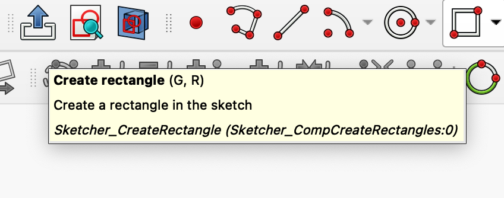

...

## The 'Create fillet' tool is a mutating tool (not a transforming tool)

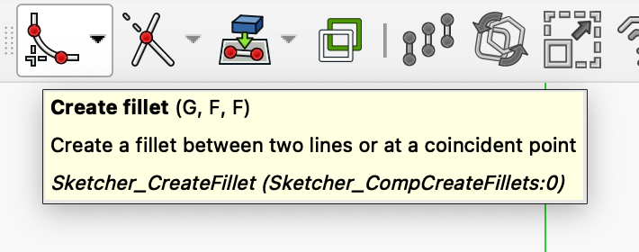

It seems when I create a fillet it mutates the 'corner' of two lines into 1: two shortened lines and 2: an arc in place of the corner?

Like, we have this 'corner'.

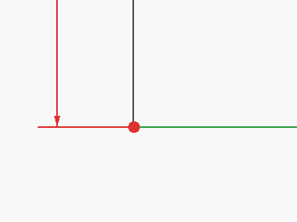

If I click the 'Create fillet' tool and then then the two lines that meet in the 'corner' - Then we get an arc created and inserted at the 'corner'.

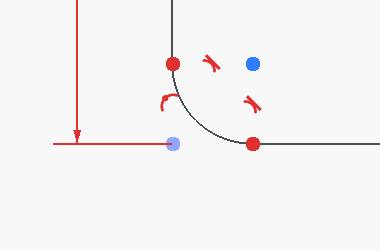

Also, it seems I need to 'dimension' the arc (the fillet) manually using the 'Dimension' tool?

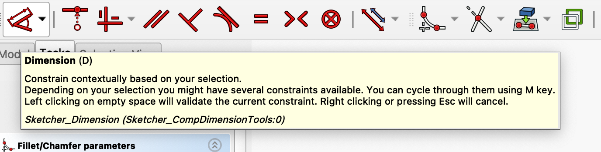

...

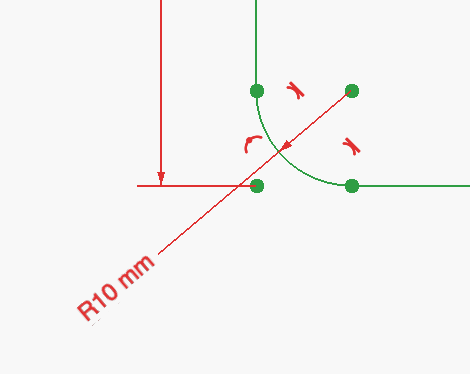

## We use 2D 'Profiles' on a sketch to 'extrude' by *padding* to a 3D 'Body'

It seems the semantics of Freecad is to draw 'Profiles' (a closed perimeter made up of lines between points) on a 'Sketch' (a 2D drawing) and then use the 'Pad' tool to *extrude* each 'Profile' into a 3D object called a 'Body'?

In this tutorial the presenter shows how to sketch this 'profile'.

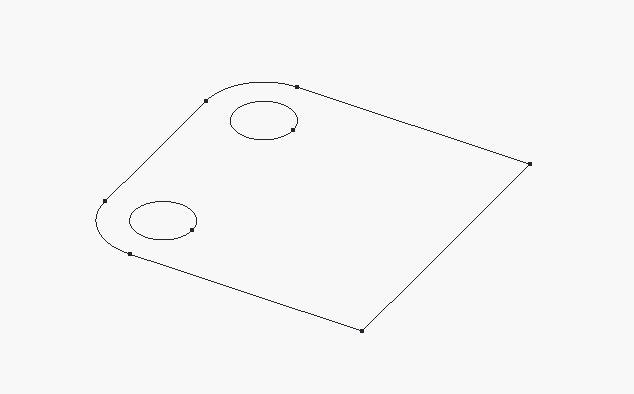

That we then select in the 'Model' and apply the 'Pad' tool on.

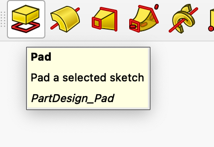

And we get a new 'Body' named *padxxx*

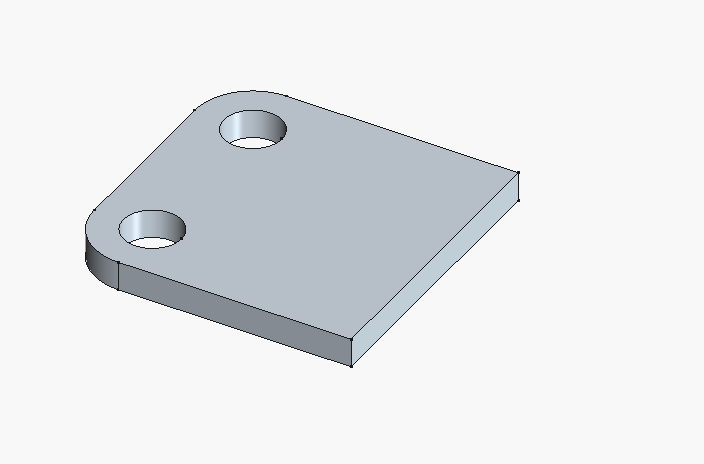

...

## The 'Create external projection geometry' is actually the way to make existing geometry accessible in a sketch

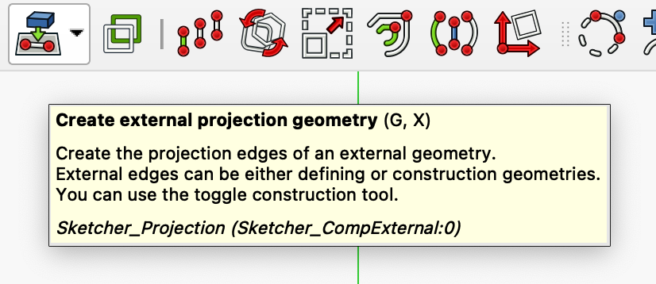

The name of this tool rubs me the wrong way. It seems we shall use it to make existing points, lines, faces or what have you, that already exists in our model, available for reference in a sketch.

Now, my expectations would bee that these should always be available? I mean, they exist in my model. So a sketch at a fix position in my model should be able to reference any other part of my model - should it not?

Anyways... We can see the 'added' line from the face our sketch is on in the 'elements' list of our sketch.

<figure>
  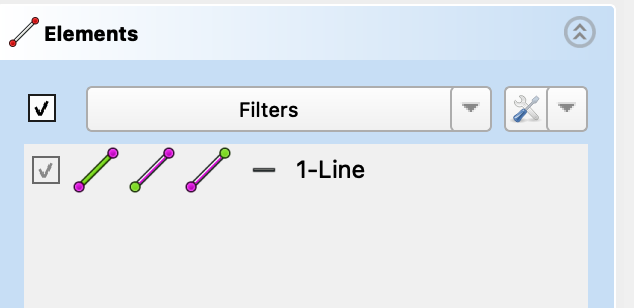
  <figcaption><em>Figure 16. Added external geometry line in sketch elements listing.</em></figcaption>
</figure>

## 2D-to-3D operation will fail if 'external geometry' is not 'construction geometry'

<figure>
  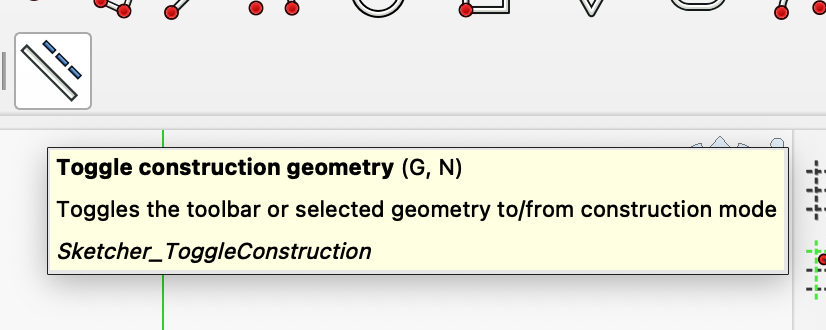
  <figcaption><em>Figure 17. The toggle construction geometry tool</em></figcaption>
</figure>

When I used 'create external geometry' the line (edge) I 'imported' was an ordinary line and not a construction line. And because of this, when I later tried to use the sketch to 'pocket away' material it failed. The sketch did not define a closed profile!

The solution was to open the sketch, select the imported line and click the 'toggle construction geometry'.

Note: I suppose we can understand a 'construction line' as a meta-line and not a real line?

## The 'descriptions' field is actually the property 'Label2' which is normally hidden!

On my macOS the F2 key did not work to open the descriptions field for an item in the model tree view.

<figure>
  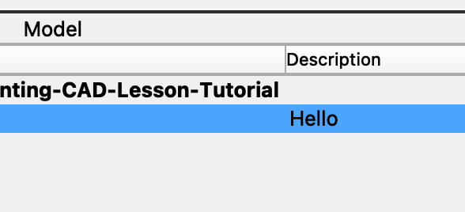
  <figcaption><em>Figure 18. The 'description' column in the Model tree view</em></figcaption>
</figure>

Instead I found this fix (https://forum.freecad.org/viewtopic.php?t=75982) explaining I need to find the 'Label2' property for the item. But this property is normally hidden! To see it I had to right click (Macbook touch pad double-finger tap) in the properties pane and click 'show hidden'.

<figure>
  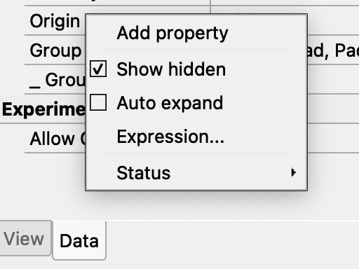
  <figcaption><em>Figure 19. The 'show hidden' check-box in the right click pop-up of model item properties pane</em></figcaption>
</figure>

<figure>
  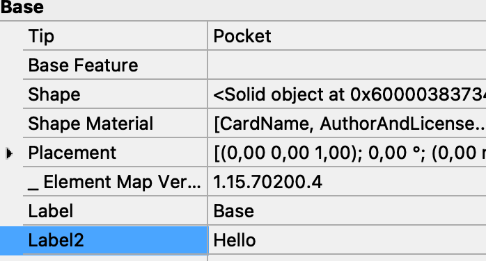
  <figcaption><em>Figure 20. The Label2 value is in fact the 'description' column value</em></figcaption>
</figure>

## What are 'Body' vs. 'Tool Shape' vs. 'Feature'?

When I applied the 'Mirrored' opretaion to the body I could choose if I wanted to *transform* a 'Body' or a 'Tool shape'.

<figure>
  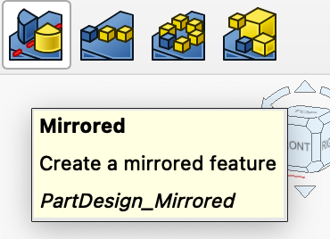
  <figcaption><em>Figure 21. The 'mirrored' tool bar button</em></figcaption>
</figure>

...

<figure>
  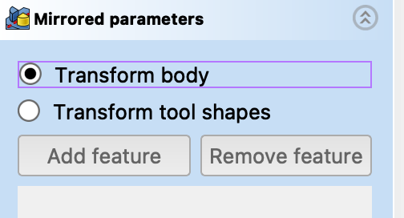
  <figcaption><em>Figure 22. Transform 'body' or 'tool shape' option of mirrored operation</em></figcaption>
</figure>

I found this confusing. Now as discussed above a 'Body' seems to be a 3D 'thingy' that are more or less 'real' in some Freecad sense? But what is a 'tool shape'? Also, the 'Mirrored' operation seems to be something called a 'feature'? What on earth is that?

Maybe this answer by chatGPT is a correct description of how Freecad models 'Features' and 'Tool shapes'?

*"'Features' are step-by-step modifications to a solid (e.g., Pad, Pocket, Fillet).
"Tool Shapes" refer to the geometric results of features.
"Tools" in FreeCAD generally mean operations that modify geometry.
Mirroring tool shapes means mirroring individual features inside the body, rather than duplicating the whole body."*

This usage of 'feature' as some kind of 'modification' rubs me the wrong way? But ok, a 'feature' is some transformation applied to a 'body'? And a 'tool shape' is the resulting 'body' after such a body mutation? Well, I need to shew on this for a while to internalise this semantics...

## A 'feature' is defined by CAD Engineering defintion of 'feature-based modelling?

It seems a 'feature' in Freecad comes from well known engeneering practice in CAD named 'feature-based modelling'?

Consider this article "What is feature-based modeling?" (https://www.engineering.com/what-is-feature-based-modeling/ )

*"Feature-based modeling comes in quite handy when you are defining or modifying a part. For example, if two circles on opposite faces of a part are recognized as a through hole, the hole will stay a through hole if the thickness of the part increases and not become a blind hole. Likewise, a slot feature will elongate properly if the centers are moved apart, rather than appear disjointed if it was a collection of geometry, forcing the user to reconnect lines to arcs."*

<figure>
  
  <figcaption><em>Figure 23. Hole feature definition. Image: Project Lead the Way (copyright https://res.cloudinary.com/engineering-com/image/upload/w_640,h_640,c_limit,q_auto,f_auto/image002_o3ao2f.jpg).</em></figcaption>
</figure>

Ok, that actually makes sense :)

## How to fix sketch that does not belong to an active body?

For some reason my second sketch seem to have been created inside the first body? It also was invisible plus the view went to a scale of around micro meters?! But maybe that is another story?

Anyhow, I draged-and-dropped it to the new second body in a try to correct the error. But now I could not extrude it. When I tried I got the error 'Cannot use selected object. Selected object must belong to the active body'.

<figure>
  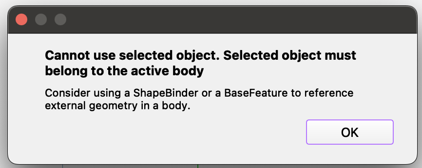
  <figcaption><em>Figure 24. Cannot use selected object. Selected object must belong to the active body</em></figcaption>
</figure>

## Don't confuse 'Part' with 'Body'!

It turns out my problem with the sktech was created in the 'wrong' body and then become without a body to belong to was because I created a new 'Part' insetad of a new 'Body'!

The reason is that the icon for 'Create part' and 'Create Body' differs only in colour!

<figure>
  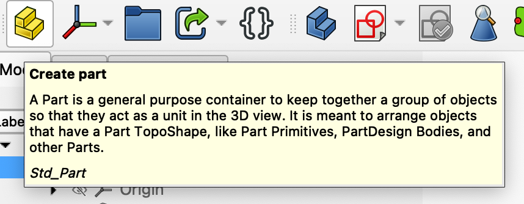
  <figcaption><em>Figure 24. The 'Create Part' icon is yellow</em></figcaption>
</figure>

<figure>
  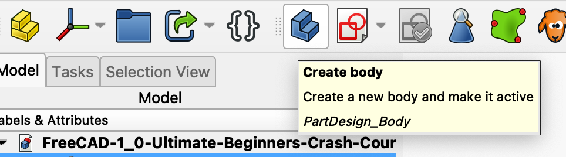
  <figcaption><em>Figure 25. The 'Create Body' icon is blue</em></figcaption>
</figure>

## Freecad 'Part', 'Body', 'Object' and 'Item' is confusing?

I would expect a 'body' to have parts? But that is NOT how Freecad treat these things.

I asked chatGPT about Freecad terms 'Part', 'Body', 'Object' and 'Item' and this is what I got for an answer.

<figure>
  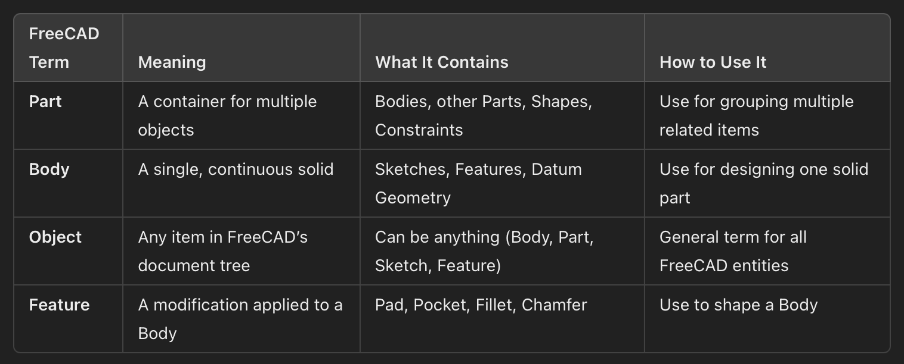
  <figcaption><em>Figure 26. How chatGPT explains Freecad 'Part', 'Body', 'Object' and 'Feature'</em></figcaption>
</figure>

So it seems a 'Part' is more like a 'Component'? A 'Part' is a container that organises 'things' into 'one thing'?

A 'Body' is a physical 'one thing'?

An 'Object' is more a data model 'thing' inside Freecad?

chatGPT did not talk about 'Item' but it seems to be things like 'lines' and 'points' on a sketch?

And finally 'Feature' is from 'feature-based modelling' that relates to a 'Body' and is both what we normally call a feature of a body. But also an operation to mutate a body to have a special feature. That is, the 'Mirror' is the 'Feature' that mirrors a 'Body' or other 'feature' to create the 'Feature' of the body to having something observable mirrored?

## A sketch must be a member of a body but can move between bodies

So I removed my 'Part' and created a 'Body' instead.

Then I right clicked my new sketch and selected 'Move object to other body'.

<figure>
  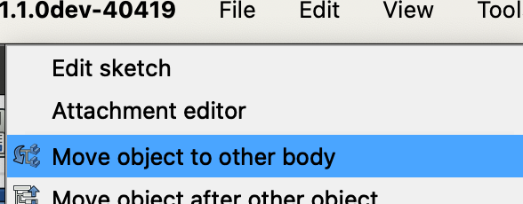
  <figcaption><em>Figure 27. The 'Move object to other body'</em></figcaption>
</figure>

In the pop-up dialog I selected the new body and pressed ok. Now my new sketch was shown to be inside the new body.

And I was finally able to 'pad' this sketch.

<figure>
  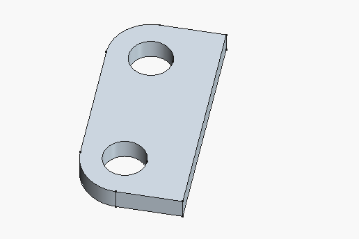
  <figcaption><em>Figure 28. The second 'pad'</em></figcaption>
</figure>

