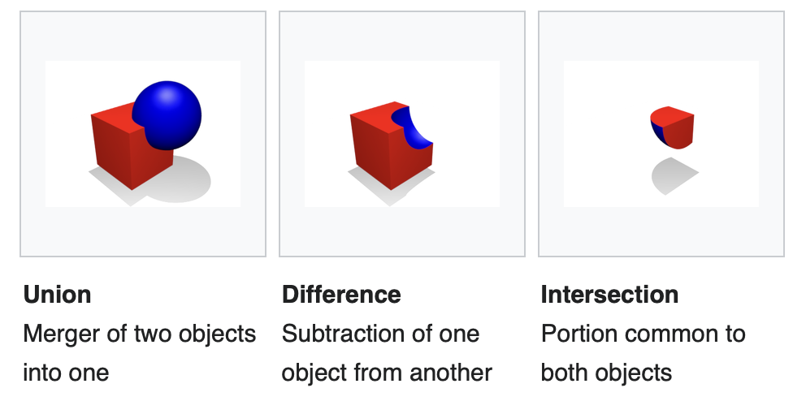
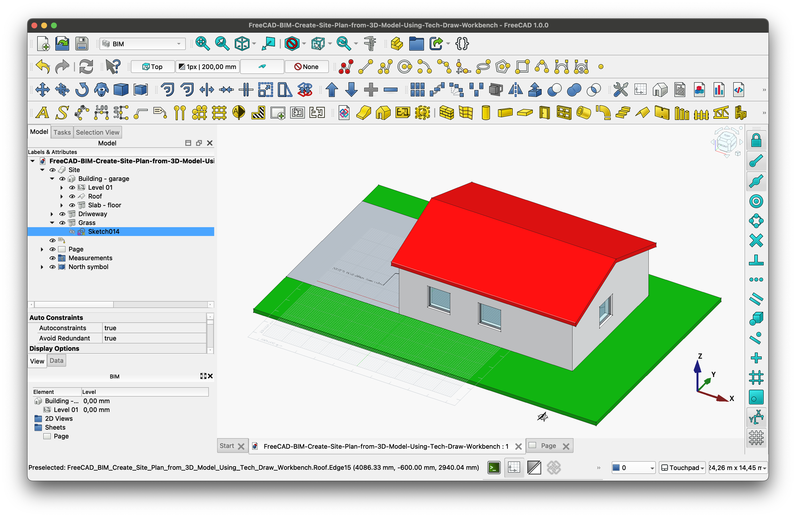
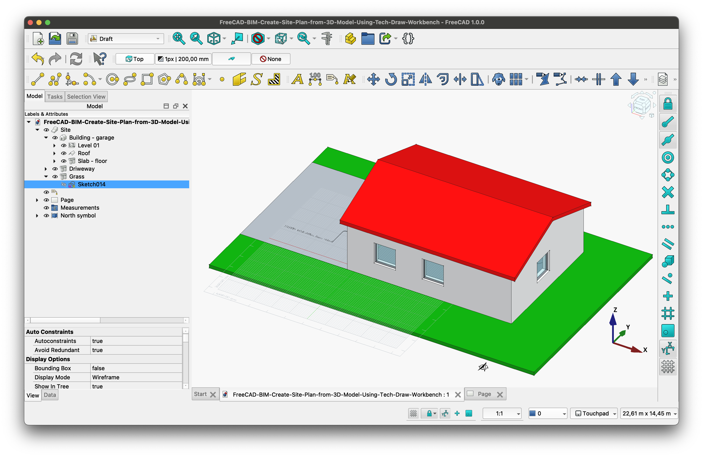
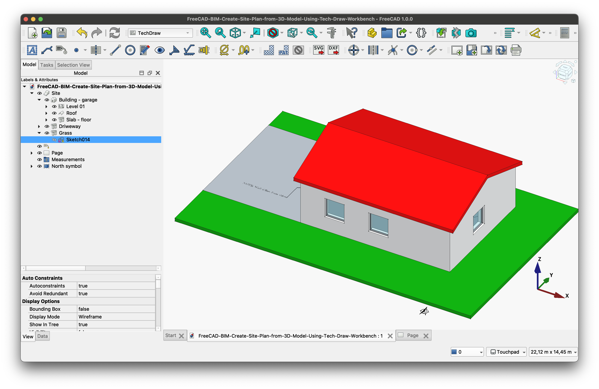

# FreeCAD Abstract

## Constructive Solid Geometry (CSG) mocdeling vs. Feature-Based Parametric Modeling

It seems in CAD modelling one can differentiate between 'Constructive Solid Geometry (CSG) mocdeling' vs. 'Feature-Based Parametric Modeling'.

The FreeCad 'Part' workbench seems to provide 'Constructive Solid Geometry (CSG) mocdeling'?

And FreeCad 'Part Design' workbench seems to provide 'Feature-Based Parametric Modeling'?

Now this does not explain the confusing naming of these 'benches'. I suppose better names would have been 'CSG Workbench' and 'Feature modeling workbench'? But then, maybe this is also confusing in its own way?

I suppose the wikipedia article 'Constructive solid geometry' (https://en.wikipedia.org/wiki/Constructive_solid_geometry) could be a good starting point to understand how and when to prefer CSG modeling and the Freecad 'Part' workbench?

And in the same way this article 'What is feature-based modeling?' (https://www.engineering.com/what-is-feature-based-modeling/) could be an equally good starting point to understand feature Based Modeling and the 'Part Design' workbench? 

<figure>
  
  <figcaption><em>Figure 23. Hole feature definition. Image: Project Lead the Way (copyright https://res.cloudinary.com/engineering-com/image/upload/w_640,h_640,c_limit,q_auto,f_auto/image002_o3ao2f.jpg).</em></figcaption>
</figure>

## It seems in Freecad the 3D model is 'global' and each 'workbench' just provides tools to work on the 3D model?

I am now of the oppinion that a workbench does NOT own any objects. That is, the 3D model of a document (file) is 'global' in that it is all there is. And switching between workbenches does not give me access no any new objects I have created or can work with?

So my coinclusion is that I am to select a workbench just for the tools this workbench exposes to me to use on the 3D model of my Freecad project (file)?

So the BIM workbench will present these tools an user interface.

And the 'Draft' workbench looks like this.

The 'Techdraw' workbench shows this user interface.

The core insight is that the 3D model to the left stays the same regardless of the workbench we select.

Also, we may switch workbench totally independent of the open tab in the view pane.

*Note: I am a bit confused that a 'Page' is a seperate tab in the view pane (while e.g., a sketch is NOT shows as a separate tab).*